# NE 205: Semiconductor Devices and IC Technology

## Homework 2

### Name : Gaurav Somani
### SR No. : 16082


```python
import scipy as sp
from scipy import constants
import matplotlib.pyplot as plt
import matplotlib.text as mtext
import matplotlib.transforms as mtransforms
import math
from operator import sub

class color:
   PURPLE = '\033[95m'
   CYAN = '\033[96m'
   DARKCYAN = '\033[36m'
   BLUE = '\033[94m'
   GREEN = '\033[92m'
   YELLOW = '\033[93m'
   RED = '\033[91m'
   BOLD = '\033[1m'
   UNDERLINE = '\033[4m'
   END = '\033[0m'
    
MU='\u03BC'    
approx= '\u2248'
epsilon_0 = 0.01*constants.epsilon_0 # multiply by 0.01 to covert to F/cm 
q=constants.e
k=constants.k

T=300

Vth=k*T/q
a0=epsilon_0/q
a1=epsilon_0*q
plt.rcParams.update({'font.size': 18})
```

### 1)

\begin{equation}
    \begin{aligned}
         R_{on}   = \frac{W}{q \mu N_D} \\[10pt]
         W_{dep}  \approx \sqrt{\frac{2\epsilon_0 \epsilon_r (\phi_B + V_R)}{q N_D}} \\[10pt]
         F_{max}  \approx \sqrt{\frac{2 q N_D (\phi_B + V_R)}{\epsilon_0 \epsilon_r}} \\[10pt]
    \end{aligned}
\end{equation}
\begin{equation}
    \begin{aligned}
     \boxed {
     (R_{on})_{max} = 0.1 m \Omega-cm^2 \\[10pt]
     F_{crit} = 8MV/cm \\[10pt]
     (V_{R})_{max} = 1000 V \\[10pt]
     \mu =  250\hspace{2pt}cm^2 / Vs \\[10pt]
     \epsilon_r = 10 \\[10pt]
     \phi_B = 1 \hspace{2pt}V\\[10pt]
     R_{on} \leq (R_{on})_{max}  \\[10pt]
     F_{max} \leq F_{crit} \hspace{5pt} at \hspace{5pt} V_R=(V_{R})_{max} \\[10pt]
     W_{dep} \leq W \hspace{5pt} at \hspace{5pt} V_R=(V_{R})_{max}
     } 
    \end{aligned}
    \label{pr1}
    \tag{1}
\end{equation}

\begin{equation}
     \implies \boxed { 
         {\frac{\epsilon_0 \epsilon_r(F_{crit})^2 }{2 q (\phi_B + (V_{R})_{max})}} \geq N_D \geq max(\frac{2\epsilon_0 \epsilon_r (\phi_B + (V_{R})_{max})}{q W^2},\frac{W}{q \mu (R_{on})_{max}})
         }
    \label{ineq1.1}
    \tag{1.1}
\end{equation}


```python
phi_b=1
mu_e=250
epsilon_r=10

Ron_max=1e-4
F_crit=8e6
Vr_max=1000

V_max=phi_b+Vr_max
c0=(q*mu_e)
c1=a0*epsilon_r

def Nd_min(W):
    return max( W/(c0*Ron_max) , 2*c1*V_max/(W*W) )

Nd_max = 0.5*c1*F_crit*F_crit/V_max

W=sp.linspace(2.4,7.2,1000)
bound = lambda W : Nd_min(W*1e-4) # convert W(in microns) to cm
Nd_minimum = sp.vectorize(bound)(W)

plt.rcParams["figure.figsize"] = (20,20)
plt.axis('auto')
plt.rc('xtick', labelsize=16) 
plt.rc('ytick', labelsize=16) 
plt.grid(True, which="both")
plt.title('Range of W and $N_D$ (Shaded region represents allowed values W and $N_D$ for given constraints)',fontsize=20)
plt.ylabel('[ $N_D$ / $10^{17}$ ] $cm^{-3}$',fontsize=16)
plt.xlabel('W ($\mu$m)',fontsize=16)
plt.xticks(sp.linspace(2.4, 7.2, 25))
plt.yticks(sp.linspace(0.85, 1.8, 20))
plt.ylim((0.85,1.8))
plt.xlim((2.4,7.2))
_, _, w, h = plt.gca().get_position().bounds
disp_ratio = h / w
data_ratio=sub(*plt.gca().get_ylim()) / sub(*plt.gca().get_xlim())
aspect=disp_ratio/data_ratio
angle_ron = math.atan(aspect*1e-21/(c0*Ron_max))
angle_wdep = math.atan(aspect*1e-17*(Nd_minimum[150]-Nd_minimum[50])/(W[150]-W[50]))
plt.text(W[500],0.02+Nd_minimum[500]*1e-17, '$R_{on}\leq (R_{on})_{max}$',rotation=math.degrees(angle_ron), rotation_mode='anchor',fontsize=16)
plt.text(W[100],0.02+Nd_minimum[100]*1e-17, '$W_{dep}\leq W$',rotation=math.degrees(angle_wdep), rotation_mode='anchor',fontsize=16)
plt.text(W[350],-0.02+Nd_max*1e-17, '$F_{max}\leq F_{crit}$',fontsize=16)
plt.text((W[500]+W[100]+W[350])/3,1e-17*(Nd_minimum[500]+Nd_minimum[100]+Nd_max)/3, 'Allowed design parameters',fontsize=16)         
plt.plot(W, Nd_minimum*1e-17,color ='blue')
plt.axhline(y=Nd_max*1e-17,color = 'green')
plt.fill_between(W, Nd_minimum*1e-17, Nd_max*1e-17, where=Nd_minimum < Nd_max,facecolor='red', alpha=0.2)
```


    <matplotlib.collections.PolyCollection at 0x7f7b6d809390>


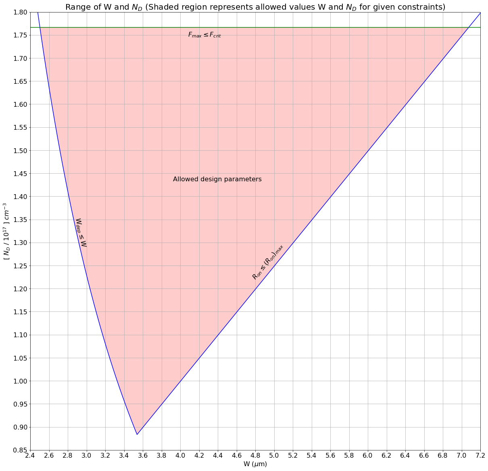


From above plot, designed parameters are bounded by the rectangle defined by these parameters.
\begin{equation}
0.88 \times 10^{17} cm^{-3} \leq N_d \leq 1.77 \times 10^{17} cm^{-3}\\[10pt]
2.5\ \mu m \leq W \leq 7.1\ \mu m
\end{equation}

### 2)

\begin{equation}
        \begin{aligned}
        \boxed {
            N_D = 10^{17} cm^{-3} \\[10pt]
            N_A = 2 \times 10^{17} cm^{-3} \\[10pt]
            D_n =  40\hspace{2pt}cm^2 / s \\[10pt]
            D_p =  10\hspace{2pt}cm^2 / s \\[10pt]
            \tau_n = \tau_p =  10^{-7} s \\[10pt]
            \tau_{dep} = 10^{-8} s \\[10pt]
            A = 10^{-4}cm^2 \\[10pt]
            F_{breakdown} = 300\hspace{2pt}kV/cm \\[10pt]
            \epsilon_r = 11.7 \\[10pt]
            T = 300 K \\[10pt]
            n_i = 1.5 \times 10^{10} cm^{-3}
         }   
        \end{aligned}
        \label{pr2}
    \tag{2}
\end{equation}
\begin{equation}
        \begin{aligned}
            \\[10pt]
            I_o  = q A n_i^2 (\sqrt{\frac{D_p}{\tau_p}} \frac{1}{N_D} + \sqrt{\frac{D_n}{\tau_n}}\frac{1}{N_A}) \\[10pt]
            I_{ideal} = I_o (e^{\frac{qV}{k_B T}}-1)
        \end{aligned}
\end{equation}
\begin{equation}
        \begin{aligned}
            \\[10pt]
  W_{dep}  = \sqrt{\frac{2\epsilon_0 \epsilon_r (V_{bi} - V) }{q} (\frac{1}{N_D} + \frac{1}{N_A})} \\[10pt]
  \mid I_{gen} \mid \approx \frac{q A n_i W_{dep}}{2\tau_{dep}} \\[10pt]
  I_{rec} \approx \frac{q A n_i W_{dep}}{2\tau_{dep}} e^{\frac{qV}{k_B T}} \approx \mid I_{gen} \mid e^{\frac{qV}{k_B T}} \\[10pt]
            I = I_{ideal}+I_{rec}- \mid I_{gen} \mid \\[10pt]
        \end{aligned}
\end{equation}
\begin{equation}
          \implies \boxed {I \approx I_o (e^{\frac{qV}{k_B T}}-1) + I_{gen} (e^{\frac{qV}{2 k_B T}}-1)}
        \label{eq2.1}
         \tag{2.1}
\end{equation}
\begin{equation}
         \boxed {F_{max}  = \sqrt{\frac{2 q (V_{bi} + V_R)}{\epsilon_0 \epsilon_r} \frac{N_A N_D}{N_A + N_D}}}
         \label{eq2.2}
         \tag{2.2}
\end{equation}
\begin{equation}
         \implies \boxed {(V_R)_{breakdown} = \frac{F_{breakdown}^2 \epsilon_0 \epsilon_r }{2q} (\frac{1}{N_D} + \frac{1}{N_A}) - V_{bi}}
         \label{eq2.3}
         \tag{2.3}
\end{equation}


```python
epsilon_r=11.7
Na=2e17
Nd=1e17
tau_n=tau_p=1e-7
D_n=40
D_p=10
A=1e-4
tau_dep=1e-8
n_i=1.5e10
c0=a0*epsilon_r
c1=(D_p/tau_p)**0.5
c2=(D_n/tau_n)**0.5
c3=1/Na + 1/Nd
I_0=q*A*n_i*n_i*(c1/Nd + c2/Na)
V_bi=Vth*sp.log(Nd*Na/(n_i*n_i))
F_br=300 # in kV/cm

V_br = 0.5*((F_br*1e3)**2)*c0*c3 - V_bi # multiply by 1e3 to convert F_br to V/cm

def W_dep(V):
    return (2*c0*(V_bi-V)*c3)**0.5

def I(V):
    I_d=0.5*q*A*W_dep(V)*n_i/tau_dep
    V_eff=V/Vth
    return 1e9*(I_0*(sp.exp(V_eff)-1)+I_d*(sp.exp(0.5*V_eff)-1)) # multiply by 1e6 to get current in nA

def F_max(V_r):
    return 1e-3*(2*(V_bi+V_r)/(c0*c3))**0.5 # multiply by 1e-3 to return electric field in kV/cm
    
V=sp.linspace(-V_br,0.5,1000)
I_V = lambda V : I(V)
I=sp.vectorize(I_V)(V)
print(color.BOLD + '2(a)' + color.END)
rb_angle = math.atan(math.log10(I[360]/I[340])/(V[360]-V[340]))
fb_angle = math.atan(math.log10(I[960]/I[940])/(V[960]-V[940]))
plt.grid(True, which="both")
plt.title('I-V Characterstics',fontsize=20)
plt.xticks(sp.linspace(-5, 0.5, 12))
plt.ylabel('Diode Current[I] (nA)',fontsize=16)
plt.xlabel('Bias Voltage[V] (V)',fontsize=16)
plt.ylim((1e-3,2e3)) 
plt.semilogy(V,abs(I))
plt.axvline(x=-V_br,ymin=math.log(abs(I[0]/plt.gca().get_ylim()[0]),plt.gca().get_ylim()[1]/plt.gca().get_ylim()[0]),color = 'red')
plt.text(V[350], 1.1*abs(I[350]), 'reverse bias',rotation=math.degrees(rb_angle), rotation_mode='anchor',fontsize=16)
plt.text(V[950], 1.1*abs(I[950]), 'forward bias',rotation=math.degrees(fb_angle), rotation_mode='anchor',fontsize=16)
plt.annotate('breakdown', xy=(-V_br, abs(I[0])), xytext=(-V_br,0.2*abs(I[0])),arrowprops=dict(facecolor='black', shrink=0.05))
plt.show()

V_r=sp.linspace(0,V_br,100)
F_maximum = lambda V_r : F_max(V_r)
F_m=sp.vectorize(F_maximum)(V_r)
print(color.BOLD + '2(b)' + color.END)
plt.grid(True, which="both")
plt.xticks(sp.linspace(0, 3.6, 19))
plt.title('Maximum Electric Field change with reverse bias voltage',fontsize=20)
plt.ylabel('Maximum Electric Field (kV/cm)',fontsize=16)
plt.yticks(sp.linspace(130, 310, 37))
plt.xlabel('Reverse Bias Voltage[$V_R$] (V)',fontsize=16)
plt.plot(V_r,F_m)
plt.annotate('breakdown', xy=(V_br, F_br), xytext=(V_br,F_br-20),arrowprops=dict(facecolor='black', shrink=0.05))
plt.show()
print("Breakdown Voltage "+approx+' '+str(round(V_br,1))+" V")
```

    2(a)


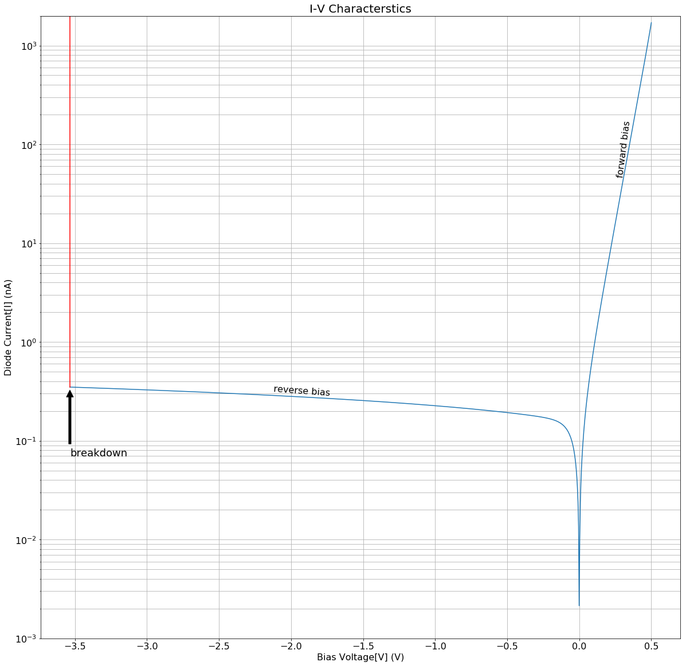


    2(b)


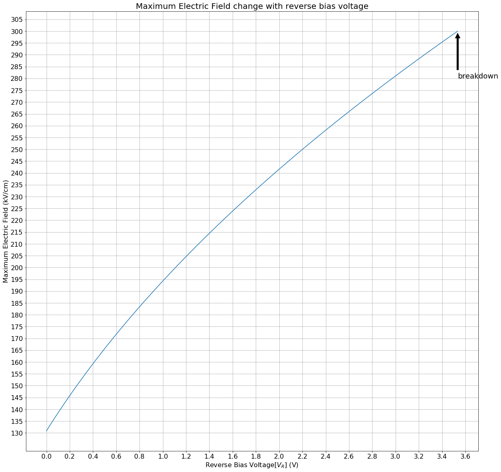


    Breakdown Voltage ≈ 3.5 V


### 3)

\begin{equation}
        \begin{aligned}
        \boxed {
            \phi_B = 0.35 \hspace{2pt} V \\[10pt]
            N_C = 3.2 \times 10^{19} cm^{-3} \\[10pt]
            V_R = 2\hspace{2pt} V \\[10pt]
            \epsilon_r = 11.7 \\[10pt]
            T = 300 K
         }   
        \end{aligned}
         \label{pr3}
    \tag{3}
\end{equation}
\begin{equation}  
  \boxed {
      V_{bi} = \phi_B+ \frac {k_B T}{q}\hspace{4pt}ln\frac{N_D}{N_C}-\frac {k_B T}{q}\hspace{25pt}(-\frac {k_B T}{q}\ accounting\ for\ Gummel\ correction)
      } 
\label{eq3.1}
\tag{3.1}
\end{equation}
\begin{equation}
         \boxed {F_{max}  = \sqrt{\frac{2 q N_D (V_{bi} + V_R)}{\epsilon_0 \epsilon_r}}} \\[10pt]
       \label{eq3.2}
         \tag{3.2}  
       \end{equation}
\begin{equation}
         W_{dep}  = \sqrt{\frac{2\epsilon_0 \epsilon_r (V_{bi} + V_R)}{q N_D}} \\[10pt]
\end{equation}
\begin{equation}
        \implies \boxed {C_j  = \frac{\epsilon_0 \epsilon_r}{W_{dep}} =\sqrt{\frac{q \epsilon_0 \epsilon_r N_D }{2(V_{bi} + V_R)}}}
       \label{eq3.3}
         \tag{3.3}
\end{equation}


```python
Nc=3.2e19
Vr=2
phi_b=0.35
V_bi = phi_b + Vth*sp.log(Nd/Nc)-Vth
V_j = Vr + V_bi
b0=2*V_j/(epsilon_r*epsilon_0)*1e-12 # constant to convert capacitance in nF/cm to Electric field in kV/cm

def C_j(Nd):
    return 1e9*(0.5*a1*epsilon_r*Nd/V_j)**0.5 # multiply by 1e9 to gey Cj in uF per square centimeter

N_d=sp.linspace(1e16,1e18,100)
cap = lambda Nd : C_j(Nd)
Cj=sp.vectorize(cap)(N_d)
F_m = lambda Cj : b0*Cj
F_max = sp.vectorize(F_m)(Cj)

plt.grid(True, which="both")
plt.title('Capacitance of junction variation with doping',fontsize=20)
plt.ylabel('Capacitance of junction[$C_j$] ( nF $cm^{-2}$)',fontsize=16)
plt.xticks(sp.linspace(0, 10, 21))
plt.yticks(sp.linspace(20, 220, 21))
plt.xlabel('[ $N_D$ / $10^{17}$ ] $cm^{-3}$',fontsize=16)
plt.plot(N_d*1e-17,Cj)
plt.show()

plt.grid(True, which="both")
plt.title('Maximum Electric Field change with doping variation',fontsize=20)
plt.ylabel('Maximum Electric Field[$F_{max}$] ( kV/cm )',fontsize=16)
plt.yticks(sp.linspace(50, 850, 33))
plt.xticks(sp.linspace(0, 10, 21))
plt.xlabel('[ $N_D$ / $10^{17}$ ] $cm^{-3}$',fontsize=16)
plt.plot(N_d*1e-17,F_max)
plt.show()
```


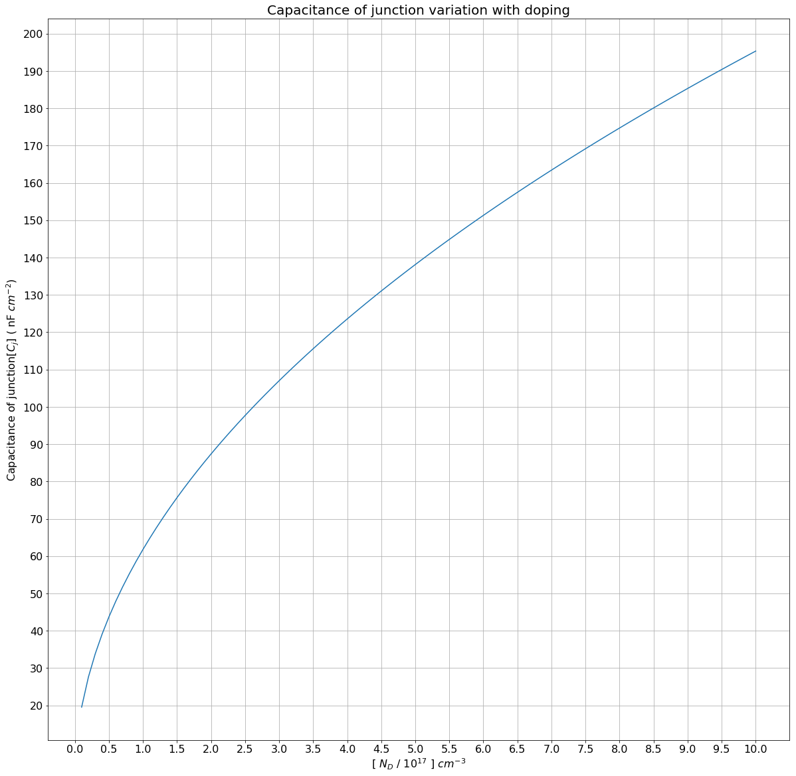


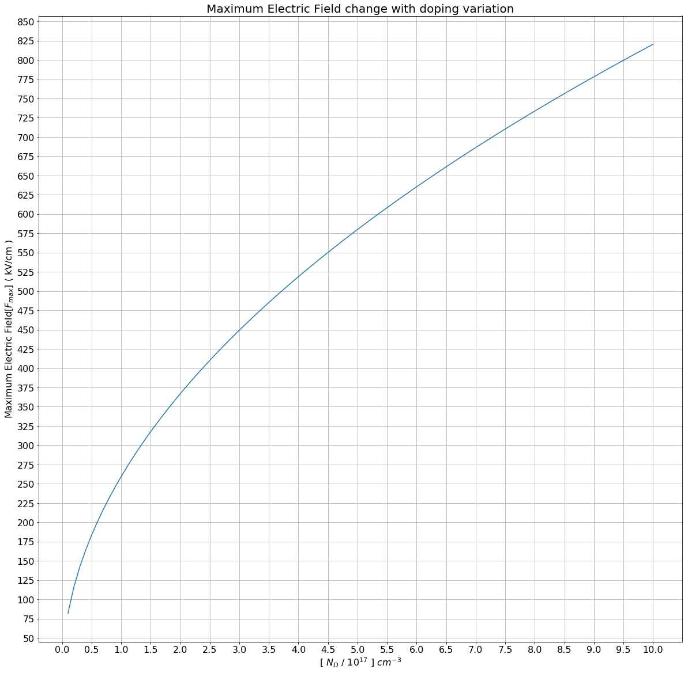


### 4)

\begin{equation}
        \begin{aligned}
        \boxed {
            N_D = 10^{17} cm^{-3} \\[10pt]
            N_C = 5 \times 10^{17} cm^{-3} \\[10pt]
            E_C-E_A = 0.3\hspace{2pt} eV \\[10pt]
            E_C-E_D = 0.5\hspace{2pt} eV \\[10pt]
            \epsilon_r = 12.9 \\[10pt]
           \sigma_A =  \sigma_D = \sigma \hspace{5pt}(Surface \hspace{5pt} density \hspace{5pt} of \hspace{5pt} each \hspace{5pt} state)
         }   
        \end{aligned}
        \label{pr4}
        \tag{4}
\end{equation}
\begin{equation}
       \begin{aligned}
         \sigma_{A^-}  =  {\frac{\sigma_A}{ 1 + 4\hspace{2pt} e^{ \frac{(E_A-E_F)_{surface}}{k_B T} }  }} \\[10pt]
         \sigma_{D^+}  =  {\frac{\sigma_D}{ 1 + 2\hspace{2pt} e^{ \frac{(E_F-E_D)_{surface}}{k_B T} }  }} \\[10pt]
         q(\sigma_{A^-} - \sigma_{D^+}) = qN_D W_{dep} \hspace{5pt}(Charge \hspace{5pt} balance\hspace{5pt} assuming \hspace{5pt} complete \hspace{5pt} depletion) \\[10pt]
  \implies q({\frac{\sigma}{ 1 + 4\hspace{2pt} e^{ \frac{(E_A-E_F)_{surface}}{k_B T} }  }} - {\frac{\sigma}{ 1 + 2\hspace{2pt} e^{ \frac{(E_F-E_D)_{surface}}{k_B T} }  }})= \sqrt{2 N_D \epsilon_0 \epsilon_r ((E_F-E_C)_{bulk}- (E_F-E_C)_{surface})}
\end{aligned}
\end{equation}  
\begin{equation}  
  \boxed {
      (E_C-E_F)_{bulk} = -k_B T(\hspace{4pt}ln(\frac{N_D}{N_C}) +  \frac{1}{\sqrt{8}} \frac{N_D}{N_C}) \hspace{20pt}(Joyce-Dixon \hspace{5pt} Approximation)
      } 
\label{eq4.1}
\tag{4.1}
\end{equation}
\begin{equation}
        \boxed {
            L_D  = \frac{1}{q}\sqrt{\frac{\epsilon_0 \epsilon_r k_B T}{N_D}}
         }
         \label{eq4.2}
        \tag{4.2}  
\end{equation}  
\begin{equation}
        \boxed {
            W_{dep}  = \frac{1}{q}\sqrt{\frac{2\epsilon_0 \epsilon_r ((E_C-E_F)_{surface}- (E_C-E_F)_{bulk})}{N_D}}
         }
         \label{eq4.3}
        \tag{4.3}  
\end{equation}  
\begin{equation}
  \implies q({\frac{\sigma}{ 1 + 4\hspace{2pt} e^{ \frac{(E_A-E_F)_{surface}}{k_B T} }  }} - {\frac{\sigma}{ 1 + 2\hspace{2pt} e^{ \frac{(E_F-E_D)_{surface}}{k_B T} }  }})= \sqrt{2 N_D \epsilon_0 \epsilon_r ((E_C-E_F)_{surface}- (E_C-E_F)_{bulk})}
\end{equation}  

\begin{equation}
\implies \boxed {
{q\sigma(\frac{1}{ 1 + 4\hspace{1pt} e^{ \frac{-(E_C-E_A)_{surface}+(E_C-E_F)_{surface}}{k_B T} } }  }- \frac{1}{ 1 + 2\hspace{1pt} e^{ \frac{(E_C-E_D)_{surface}-(E_C-E_F)_{surface}}{k_B T}  }  }) \\[30pt] \hspace{60pt}= \sqrt{2 N_D \epsilon_0 \epsilon_r ((E_C-E_F)_{surface}- (E_C-E_F)_{bulk})}
}
\label{eq4.4}
\tag{4.4}  
\end{equation}

Using $\eqref{eq4.1}$ and $\eqref{eq4.4}$,  $(E_C-E_F)_{surface}$ can be calculated by bisection method for a paticular $\sigma$.

Band bending (conduction band edge) in depletion region can be approximated as 

\begin{equation}  
  \boxed {
               E_C - E_F =  (E_C-E_F)_{bulk} + \frac{q^2 (x-W_{dep})^2 N_D} {2\epsilon_0 \epsilon_r} \\[15pt]
               \hspace{100pt} where \hspace{5pt} 0 \leq x \leq W_{dep}\\[5pt]
                when\ (E_C-E_F)_{surface} - (E_C-E_F)_{bulk}\gt 3 k_B T
          } 
\label{eq4.5a}
\tag{4.5a}
\end{equation}

\begin{equation}  
  \boxed {
               E_C - E_F = (E_C-E_F)_{bulk} + ((E_C-E_F)_{surface}-(E_C-E_F)_{bulk})\ e^{\frac{-x}{L_{D}}}  \\[15pt]
               \hspace{100pt} where \hspace{5pt} 0 \leq x \leq W_{dep}\\[5pt]
               when\ (E_C-E_F)_{surface} - (E_C-E_F)_{bulk}\lt \lt k_B T\\[5pt]
               Here, W_{dep} \lt L_D\ and\ conduction\ band\ bottom\ is\ decreasing\ exponentially.\   
      } 
\label{eq4.5b}
\tag{4.5b}
\end{equation}


where $W_{dep}$ is calculated using $\eqref{eq4.3}$ and $(E_C-E_F)_{bulk}$ is calculated using $\eqref{eq4.1}$.
Here, $x=0$ represents the surface and semiconductor is present where $x>0$. Outside the delpetion region, conduction band is flat.


```python
Nc=5e17
Nd=1e17
diff=Vth*(sp.log(Nd/Nc) +  Nd/(Nc*(8**0.5)))
E_a = -0.3
E_d = -0.5
epsilon_r=12.9
b1=2*a1*epsilon_r*Nd
b2=2*a0*epsilon_r/Nd
Eg=1441 #in meV
L_d=(0.5*b2*Vth)**0.5

def E_fermi(sigma):
    Ef_min=min(E_a,E_d)
    Ef_max=diff
    while(Ef_max-Ef_min > 1e-6):
        Ef = 0.5*(Ef_min+Ef_max)      
        sigma_diff = sigma * q *( 1/ (1 + 4*sp.exp((E_a-Ef)/Vth))  - 1 / (1 + 2*sp.exp((Ef-E_d)/Vth)) )
        Q_dep=(b1*(diff-Ef))**0.5
        if(sigma_diff>Q_dep):
            Ef_max=Ef
        else:
            Ef_min=Ef
    return Ef
    
sigma = sp.logspace(10,14,1000)
E_f = lambda sigma : E_fermi(sigma)
Ef=sp.vectorize(E_f)(sigma)

def W_depletion(Ef):
    return (b2*(diff-Ef))**0.5

W_d = lambda Ef : W_depletion(Ef)
W_dep=sp.vectorize(W_d)(Ef)
    
def Ec(x,W_d):
    if x<W_d:
        return (x-W_d)*(x-W_d)/b2 - diff # E_c with repect to fermi level in depletion region
    else:
        return -diff # E_c with repect to fermi level in bulk
        
sigma_s=sp.array([1e10,1e11,5e11,1e13,1e14])
E_fs = lambda sigma_s : E_fermi(sigma_s) 
Ef_s = sp.vectorize(E_fs)(sigma_s)
W = lambda Ef : W_depletion(Ef) 
W_depl=sp.vectorize(W)(Ef_s)

x=sp.linspace(0,1e7*(1.1*W_depl[4]),100) # multiply by 1e7 to convert to nm
Ecb_f=sp.zeros(shape=(5,100))
Ecb_cs=sp.zeros(shape=(5,100))

for i in range(5):
    if(-Ef_s[i]>3*Vth):
        E_c = lambda x : 1e3*Ec(x,W_depl[i]) # multiply by 1e3 to convert to meV
    else:
        E_c = lambda x: 1e3*(-diff+(-Ef_s[i]+diff)*math.exp(-x/L_d))
    Ecb_f[i]= sp.vectorize(E_c)(x*1e-7) # multiply by 1e-7 to convert to cm and this is wrt fermi level     
    Ecb_cs[i]=Ecb_f[i]-(1e3*Ec(0,W_depl[i])) # this is wrt conduction band edge at surface
    
plt.rcParams["figure.figsize"] = (20,20)
plt.grid(True, which="both")
plt.title('Fermi level (with respect to conduction band edge at surface) variation due to surface defects',fontsize=20)
plt.ylabel('Fermi level with respect to conduction band edge at surface [$(E_F-E_C)_{surface}$] (meV)',fontsize=16)
plt.xlabel('Surface defect density[$\sigma$] ($cm^{-2}$)',fontsize=16)
plt.yticks(sp.linspace(-380, -40, 35))
plt.semilogx(sigma,Ef*1e3) # multiply by 1e3 to convert to meV
plt.show()

plt.grid(True, which="both")
plt.title('Conduction band bending with varying surface defect density (Energy with respect to fermi level)',fontsize=20)
plt.ylabel('Conduction band bottom  energy with respect to fermi level ($E_C-E_F$) (meV)',fontsize=16)
plt.xlabel('Distance from surface[x] (nm)',fontsize=16)
plt.xlim((0,1.1*W_depl[4]*1e7)) # multiply by 1e7 to convert to nm
plt.plot(x,Ecb_f[0],x,Ecb_f[1],x,Ecb_f[2],x,Ecb_f[3],x,Ecb_f[4])
plt.yticks(sp.linspace(40, 380, 35))
plt.xticks(sp.linspace(0, 72, 37))
for i in range(1,5):
    plt.text(x[0], Ecb_f[i][0], '$\sigma = 10^{'+str(i+10)+'} cm^{-2}$',fontsize=16)
plt.text(x[0],-6+ Ecb_f[0][0], '$\sigma = 10^{'+str(10)+'} cm^{-2}$',fontsize=16)
plt.show()

plt.grid(True, which="both")
plt.title('Conduction band bending with varying surface defect density (Energy with respect to conduction band bottom at surface)',fontsize=20)
plt.ylabel('Conduction band bottom  energy with respect to conduction band edge at surface ($E_C-(E_C)_{surface}$) (meV)',fontsize=16)
plt.xlabel('Distance from surface[x] (nm)',fontsize=16)
plt.xlim((0,1.1*W_depl[4]*1e7)) # multiply by 1e7 to convert to nm
plt.yticks(sp.linspace(-340, 0, 35))
plt.xticks(sp.linspace(0, 72, 37))
plt.plot(x,Ecb_cs[0],x,Ecb_cs[1],x,Ecb_cs[2],x,Ecb_cs[3],x,Ecb_cs[4])
for i in range(5):
    plt.text(x[50], Ecb_cs[i][50], '$\sigma = 10^{'+str(i+10)+'} cm^{-2}$',fontsize=16)    
plt.show()

for i in range(5):
    Ef_cs=1e3*E_fermi(sigma_s[i]) # multiply by 1e3 to convert to meV
    Ea=E_a*1e3 # multiply by 1e3 to convert to meV
    Ed=E_d*1e3 # multiply by 1e3 to convert to meV
    E_vb=Ecb_cs[i]-Eg
    plt.grid(True, which="both")
    plt.title('Band diagram ($\sigma = 10^{'+str(i+10)+'} cm^{-2}$)',fontsize=20)
    plt.ylabel('Electron Energy (meV)',fontsize=16)
    plt.xlabel('Distance from surface[x] (nm)',fontsize=16)
    plt.axhline(y=Ea,color = 'green',xmax=0.01)
    plt.text(1,Ea, 'Acceptor level',fontsize=16)
    plt.axhline(y=Ed,color = 'red',xmax=0.01)
    plt.text(1,Ed, 'Donor level',fontsize=16)
    plt.axhline(y=Ef_cs,color = 'orange')
    plt.text(x[85],Ef_cs+1, 'Fermi level',fontsize=16)
    plt.xlim((0,1.1*W_depl[4]*1e7)) # multiply by 1e7 to convert to nm
    plt.yticks(sp.linspace(0, -1800, 37))
    plt.xticks(sp.linspace(0, 72, 37))
    plt.plot(x,Ecb_cs[i],x,E_vb)
    plt.text(x[80],Ecb_cs[i][80]+1, 'Conduction band bottom',fontsize=16)
    plt.text(x[80],E_vb[80]-20, 'Valence band top',fontsize=16)
    if (Ef_cs<Ea/2):
        plt.annotate('Fermi pinning', xy=(x[0],Ef_cs) , xytext=(x[0],Ef_cs-20),arrowprops=dict(facecolor='black', shrink=0.05))
    plt.show()
```


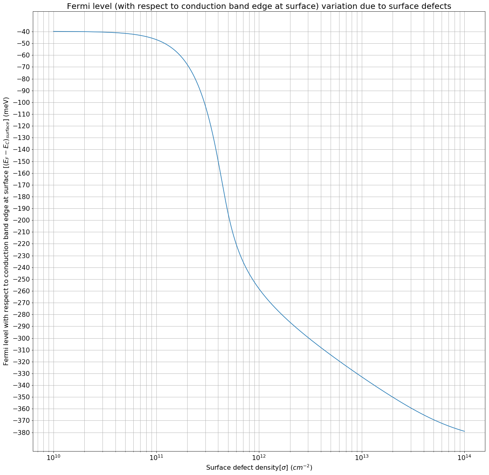


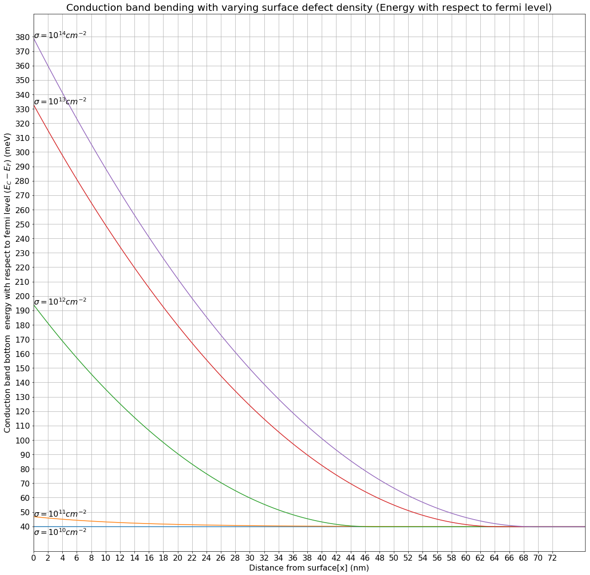


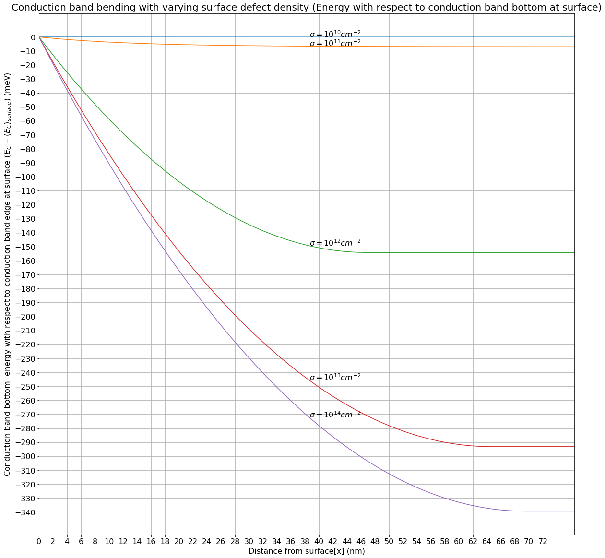


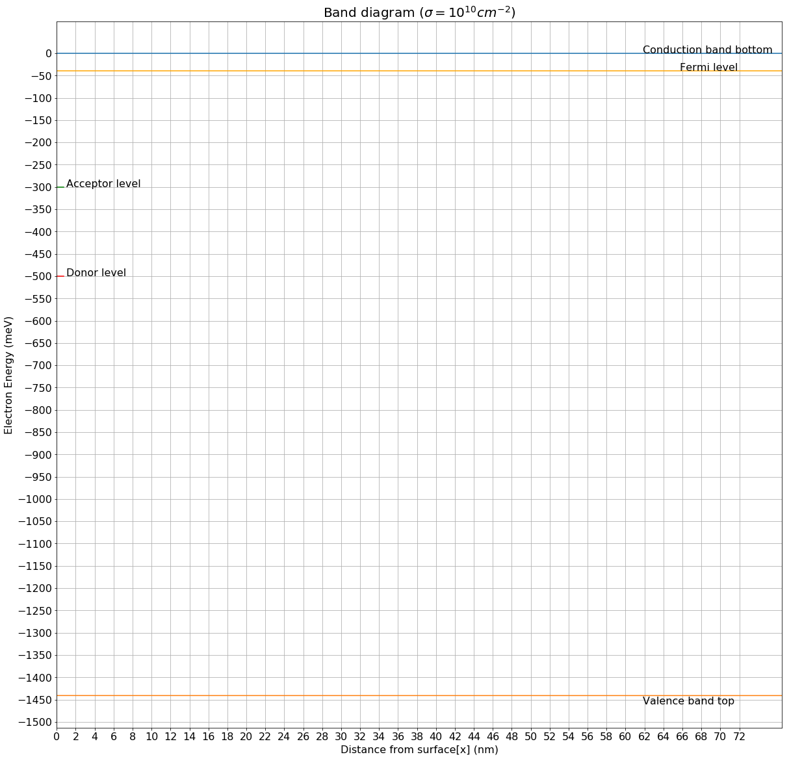


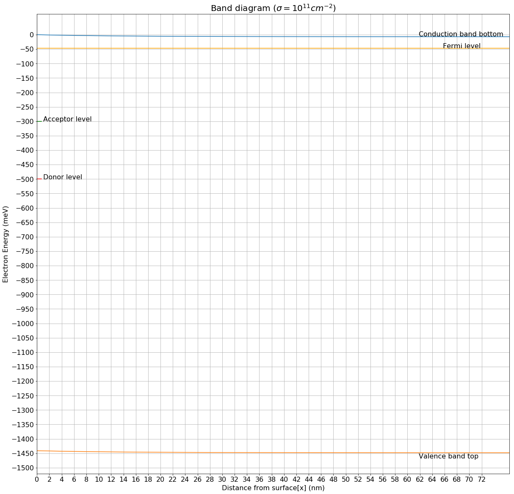


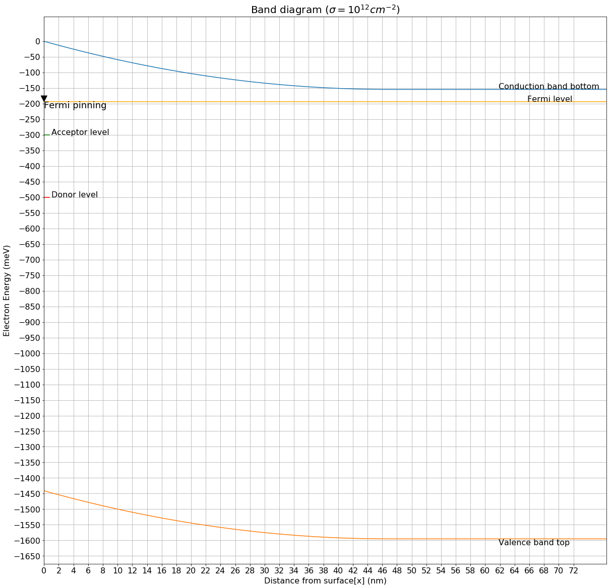


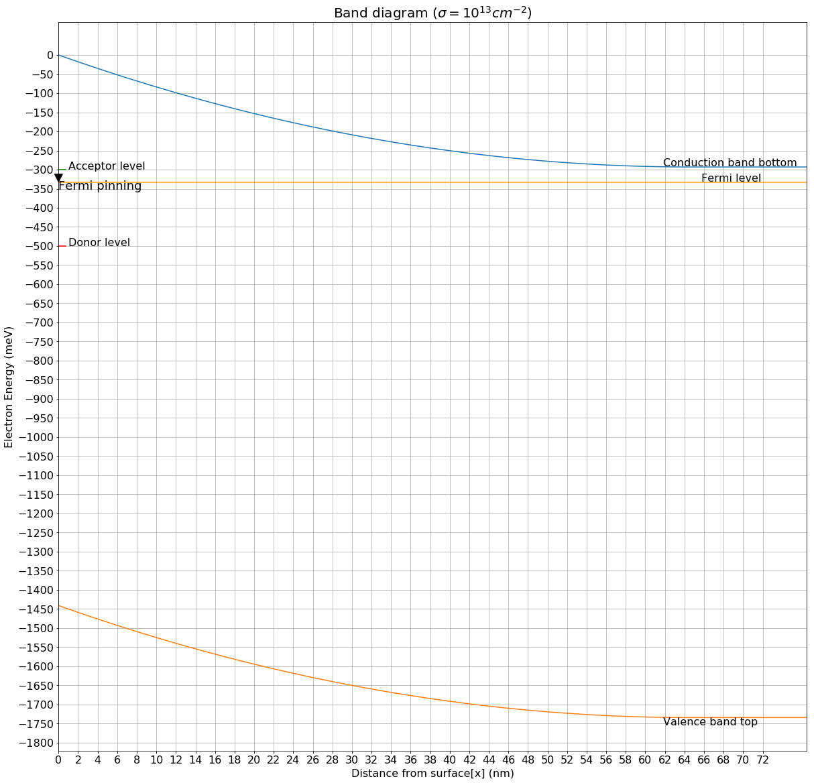


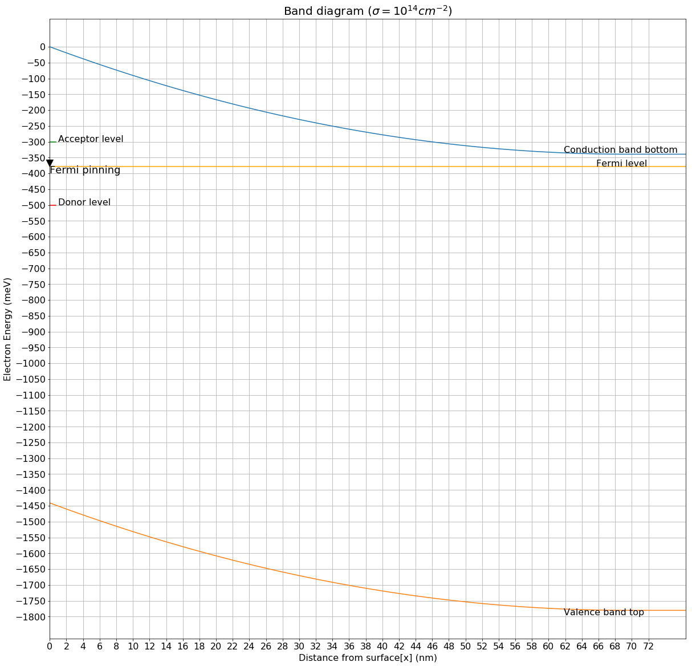


Significant fermi pinning is observed when **$\sigma$(surface defect density)** $\geq 10^{12} cm^{-2}$. It becomes increasingly effective as **(surface defect density)**$\sigma$ increases from $10^{12} cm^{-2}\ to\ 10^{14} cm^{-2}$. 

### 5)

For **p+/n junction** in a long diode,

\begin{equation}
I(t) = \frac{d}{dt}Q_p(t) + \frac{Q_p(t)}{\tau_p}
\end{equation}

Multiplying both sides by $e^{\frac{t}{\tau_p}}$, 

\begin{equation}
I(t) e^{\frac{t}{\tau_p}}  = e^{\frac{t}{\tau_p}} \frac{d}{dt}Q_p(t) + \frac{e^{\frac{t}{\tau_p}}}{\tau_p}Q_p(t) \\[5pt]
\implies I(t) e^{\frac{t}{\tau_p}} =  \frac{d}{dt}(e^{\frac{t}{\tau_p}}Q_p(t)) \\[5pt]
\implies \int_{0}^{t} I(t') e^{\frac{t'}{\tau_p}} dt' =  \int_{0}^{t} d(e^{\frac{t'}{\tau_p}}Q_p(t')) \\[5pt]
\implies \int_{0}^{t} I(t') e^{\frac{t'}{\tau_p}} dt' =  e^{\frac{t}{\tau_p}}Q_p(t) - Q_p(0) \\[5pt]
\end{equation}
\begin{equation}
\implies \boxed{
Q_p(t) = (\hspace{4pt}Q_p(0) + \int_{0}^{t} I(t') e^{\frac{t'}{\tau_p}} dt'\hspace{4pt})\hspace{4pt} e^{\frac{-t}{\tau_p}}
}
\label{eq5.1}
\tag{5.1}
\end{equation}

\begin{equation}
I_{steady} = \frac{Q_p}{\tau_p} \hspace{5pt} since \hspace{5pt} \frac{d}{dt}Q_p(t) = 0 \\[5pt]
\implies I(0) = \frac{Q_p(0)}{\tau_p}\\[15pt]
\end{equation}
\begin{equation}
\implies \boxed {Q_p(0) = I(0^-) \tau_p}
\label{eq5.2}
\tag{5.2}
\end{equation}

Using $\eqref{eq5.1}$ and $\eqref{eq5.2}$,

\begin{equation}
\boxed{
Q_p(t) = ( \hspace{4pt}I(0^-) \tau_p + \int_{0}^{t} I(t') e^{\frac{t'}{\tau_p}} dt'\hspace{4pt})\hspace{4pt} e^{\frac{-t}{\tau_p}}
}
\label{eq5.3}
\tag{5.3}
\end{equation}

Stored charge $Q_p(t)$ can be calclated as total charge of excess holes in n-region of diode.
Here, x=0 represents the end of depletion adjacent to n-region of diode and x > 0 in n-region of diode. 
\begin{equation}
Q_p(t) = \int_{0}^{\infty} q A \Delta p_n(x,t) \hspace{4pt}dx \\[15pt]
\implies Q_p(t) = \int_{0}^{\infty} q A \Delta p_n(0,t) \hspace{4pt} e^{\frac{-x}{L_p}}\hspace{4pt}dx \hspace{10pt} since\hspace{10pt} \Delta p_n(x,t) = \Delta p_n(0,t) \hspace{4pt} e^{\frac{-x}{L_p}} \\[15pt]
\implies Q_p(t) = q A L_p \Delta p_n(0,t)  \int_{0}^{\infty} \frac{1}{L_p}\hspace{4pt} e^{\frac{-x}{L_p}}\hspace{4pt}dx\\[15pt]
\implies Q_p(t) = q A L_p \Delta p_n(0,t)  \int_{0}^{\infty} \hspace{4pt} d(-e^{\frac{-x}{L_p}}) \\[15pt]
\end{equation}
\begin{equation}
\implies \boxed {Q_p(t) = q A L_p \Delta p_n(0,t)}   \\[15pt]
\label{eq5.4}
\tag{5.4}
\end{equation}

Voltage across diode $V(t)$ can be given by minority carrier concentration profile (holes in n-region) assuming quasi-fermi level of holes completely dropping across n-region near depletion region.
    
\begin{equation}
        V(t) = \frac{k_B T}{q}\hspace{4pt}ln(\frac{p_n(0,t)}{p_{n_0}})\\[5pt]
        \implies V(t) = \frac{k_B T}{q}\hspace{4pt}ln\hspace{2pt}(\hspace{4pt}1 + \frac{\Delta p_n(0,t)}{p_{n_0}}\hspace{4pt})
\end{equation}

Using ([5.4](#mjx-eqn-eq5.4)),

\begin{equation}
\implies \boxed {V(t) = \frac{k_B T}{q}\hspace{4pt}ln\hspace{2pt}(\hspace{4pt}1 + \frac{Q_p(t)}{q A L_p p_{n_0}}\hspace{4pt})}
\label{eq5.5}
\tag{5.5}
\end{equation}

Let $I_0$ be reverse saturation current of the diode. Then, for **p+/n junction**,

\begin{equation}
        I_0 = q A \frac{L_p}{\tau_p}p_{n_0} \\[5pt]
        \implies I_0 \tau_p = q A L_p p_{n_0}
\end{equation}

Putting this in $\eqref{eq5.5}$,

\begin{equation}
\boxed {V(t) = \frac{k_B T}{q}\hspace{4pt}ln\hspace{2pt}(\hspace{4pt}1 + \frac{Q_p(t)}{I_0 \tau_p }\hspace{4pt})}
\label{eq5.6}
\tag{5.6}
\end{equation}

Using ([5.3](#mjx-eqn-eq5.3)), $Q_p(t)$ can be calculated and putting $Q_p(t)$ in $\eqref{eq5.6}, V(t)$ can be calculated.

**a)**

\begin{equation}
\boxed {
I(t)=I_F \hspace{5pt}when\hspace{5pt} t\lt0 \\[5pt]
I(t)=I_F e^{\frac{-t}{\tau_p}} \hspace{5pt}when\hspace{5pt} t\geq0
}
\label{eq5.a}
\tag{5.a}
\end{equation}

Putting $\eqref{eq5.a}$ in ([5.3](#mjx-eqn-eq5.3)),

\begin{equation}
Q_p(t) = ( \hspace{4pt}I_F \hspace{2pt}\tau_p + \int_{0}^{t} I_F  \hspace{4pt} dt'\hspace{4pt})\hspace{4pt} e^{\frac{-t}{\tau_p}}\hspace{15pt} since \hspace{10pt} I(0^-) = I_F \\[5pt]
\implies Q_p(t) = ( \hspace{4pt}I_F \hspace{2pt}\tau_p +  I_F  \hspace{2pt} t\hspace{4pt})\hspace{4pt} e^{\frac{-t}{\tau_p}}\hspace{15pt}\\[5pt]
\end{equation}

\begin{equation}
\implies \boxed {Q_p(t) = \hspace{4pt}I_F \hspace{2pt}(\tau_p + t)\hspace{4pt} e^{\frac{-t}{\tau_p}}}
\label{eq5.a1}
\tag{5.a1}
\end{equation}

Putting $\eqref{eq5.a1}$ in $\eqref{eq5.6}$,

\begin{equation}
V(t) = \frac{k_B T}{q}\hspace{4pt}ln\hspace{2pt}(\hspace{4pt}1 + \frac{\hspace{4pt}I_F \hspace{2pt}(\tau_p + t)\hspace{4pt} e^{\frac{-t}{\tau_p}}}{I_0 \tau_p }\hspace{4pt})
\end{equation}

\begin{equation}
\implies \boxed { V(t) = \frac{k_B T}{q}\hspace{4pt}ln\hspace{2pt}(\hspace{4pt}1 + \frac{\hspace{4pt}I_F \hspace{2pt}\hspace{4pt} }{I_0}(1+\frac{t}{\tau_p}) e^{\frac{-t}{\tau_p}}\hspace{4pt})}
\label{eq5.a2}
\tag{5.a2}
\end{equation}

**b)**

\begin{equation}
        \begin{aligned}
        \boxed {
            I_0 = 0.2 \mu A \\[10pt]
            I_F = 5 mA \\[10pt]
            t =  10 \mu s \\[10pt]
            \frac{V(t)}{V(0)} =  \frac{2}{3} \\[10pt]
            }   
        \end{aligned}
        \label{pr5b}
    \tag{p.5b}
\end{equation}

\begin{equation}
\boxed {
I(t)=I_F \hspace{5pt}when\hspace{5pt} t\lt0 \\[5pt]
I(t)=0 \hspace{5pt}when\hspace{5pt} t\geq0
}
\label{eq5.b}
\tag{5.b}
\end{equation}

Putting $\eqref{eq5.b}$ in ([5.3](#mjx-eqn-eq5.3)),

\begin{equation}
Q_p(t) = ( \hspace{4pt}I_F \hspace{2pt}\tau_p + \int_{0}^{t} 0 \hspace{4pt} dt'\hspace{4pt})\hspace{4pt} e^{\frac{-t}{\tau_p}}\hspace{15pt} since \hspace{10pt} I(0^-) = I_F \\[5pt]
\end{equation}

\begin{equation}
\implies \boxed {Q_p(t) = \hspace{4pt}I_F \hspace{2pt}\tau_p\hspace{4pt} e^{\frac{-t}{\tau_p}}}
\label{eq5.b1}
\tag{5.b1}
\end{equation}

Putting $\eqref{eq5.b1}$ in ([5.6](#mjx-eqn-eq5.6)),

\begin{equation}
V(t) = \frac{k_B T}{q}\hspace{2pt}ln\hspace{2pt}(\hspace{2pt}1 + \frac{I_F \tau_p\hspace{2pt} e^{\frac{-t}{\tau_p}}}{I_0 \tau_p }\hspace{2pt})
\end{equation}

\begin{equation}
\implies \boxed { V(t) = \frac{k_B T}{q}\hspace{2pt}ln\hspace{2pt}(\hspace{2pt}1 + \frac{I_F\hspace{2pt} }{I_0}e^{\frac{-t}{\tau_p}}\hspace{2pt})}
\label{eq5.b2}
\tag{5.b2}
\end{equation}
\begin{equation}
\implies \boxed { V(0) = \frac{k_B T}{q}\hspace{2pt}ln\hspace{2pt}(\hspace{2pt}1 + \frac{I_F}{I_0}\hspace{2pt})}
\label{eq5.b3}
\tag{5.b3}
\end{equation}

Dividing $\eqref{eq5.b2}$ by $\eqref{eq5.b3}$,

\begin{equation}
\implies \frac{V(t)}{V(0)} = \frac {ln\hspace{2pt}(\hspace{2pt}1 + \frac{I_F}{I_0} e^{\frac{-t}{\tau_p}})} { ln ( 1 + \frac{I_F}{I_0})} \\[5pt]
\implies  \frac{V(t)}{V(0)}\ ln ( 1 + \frac{I_F}{I_0})  = ln\hspace{2pt}(\hspace{2pt}1 + \frac{I_F}{I_0} e^{\frac{-t}{\tau_p}}) \\[5pt]
\implies  exp(\ \frac{V(t)}{V(0)}\ ln ( 1 + \frac{I_F}{I_0})\ )  = 1 + \frac{I_F}{I_0} e^{\frac{-t}{\tau_p}} \\[5pt]
\implies  ( 1 + \frac{I_F}{I_0}) ^ \frac{V(t)}{V(0)} = 1 + \frac{I_F}{I_0} e^{\frac{-t}{\tau_p}} \\[5pt]
\implies  \frac{I_0}{I_F}\ (\ ( 1 + \frac{I_F}{I_0}) ^ \frac{V(t)}{V(0)} - 1\ )\ =  e^{\frac{-t}{\tau_p}} \\[5pt]
\implies  ln\ (\ \frac{I_0}{I_F}\ (\ ( 1 + \frac{I_F}{I_0}) ^ \frac{V(t)}{V(0)} - 1\ )\ )=  \frac{-t}{\tau_p}
\end{equation}

\begin{equation}
\\[5pt]
\implies  \boxed {\tau_p = \frac{-t}{ln\ (\ \frac{I_0}{I_F}\ (\ ( 1 + \frac{I_F}{I_0}) ^ \frac{V(t)}{V(0)} - 1\ )\ )}}
\label{eq5.b4}
\tag{5.b4}
\end{equation}

Putting $\eqref{pr5b}$ in $\eqref{eq5.b4}$, $\tau_p$ (hole lifetime in n-region of the diode) can be calculated.


```python
I_0=0.2 # in uA
I_F=5e3 # in uA
current_ratio = I_F/I_0
voltage_ratio = 2/3 # V(t)/V(0)
t=10 # in us
tau_p = -t/math.log(((1+current_ratio)**(voltage_ratio)-1)/current_ratio)
print("Hole lifetime in the neutral n-region of the diode "+approx+' '+str(round(tau_p))+ ' ' +MU +'s')
```

    Hole lifetime in the neutral n-region of the diode ≈ 3 μs

