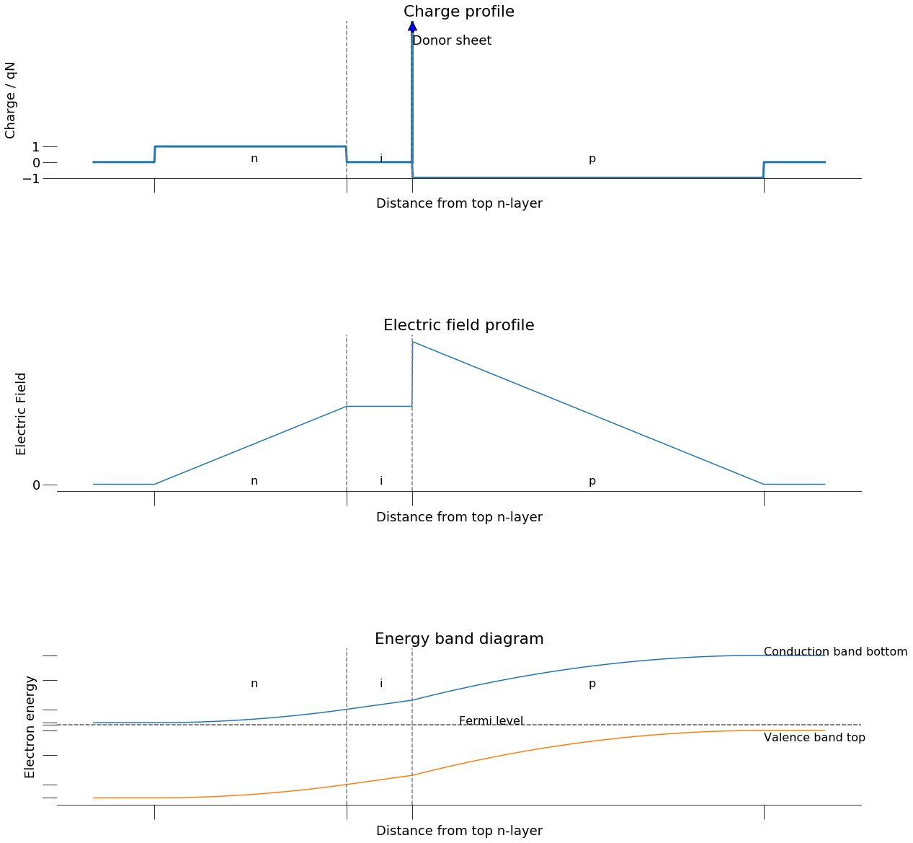

# NE 205: Semiconductor Devices and IC Technology

## Homework 3

### Name : Gaurav Somani
### SR No. : 16082


```sos
%matplotlib inline

import scipy as sp
from scipy import constants
import matplotlib.pyplot as plt
import matplotlib.text as mtext
import matplotlib.transforms as mtransforms
import math
from operator import sub

class color:
   PURPLE = '\033[95m'
   CYAN = '\033[96m'
   DARKCYAN = '\033[36m'
   BLUE = '\033[94m'
   GREEN = '\033[92m'
   YELLOW = '\033[93m'
   RED = '\033[91m'
   BOLD = '\033[1m'
   UNDERLINE = '\033[4m'
   END = '\033[0m'
    
MU='\u03BC'    
approx= '\u2248'
exponent_2= '\u00b2'
epsilon_0 = 0.01*constants.epsilon_0 # multiply by 0.01 to covert to F/cm 
q=constants.e
k=constants.k
pi=constants.pi
h=constants.h
hbar=constants.hbar
m0=constants.m_e

T=300

Vth=k*T/q
d2_dos= 1e-4*q*m0/(pi*hbar*hbar) # ground state density of states in 2d system per eV per square cm
Eh = 1e18*h*h/(8*q*m0) # ground state energy in 1nm quantum well in eV
a0=epsilon_0/q
a1=(2**(-1.5))
plt.rcParams.update({'font.size': 18})
plt.rcParams["figure.figsize"] = (20,20)
```


```sos
epsilon_r=13
Nd=2e18
Na=4e19
Nsh=2e19
Vic=0.3
Wic=0.4e-4 # in cm
a2=epsilon_r*a0
Eg=1.42
Nc=4.7e17
Nv=7e18
r1=Na/Nv
r2=Nd/Nc
diff=Eg+Vth*(math.log(r1*r2)+a1*(r1+r2))
Vd=round(diff,2)
```


```sos
%expand {{ }}

### 1)

\begin{equation}
\begin{aligned}
        \boxed {
            N_{D,sub-collector} = 2 \times 10^{18} cm^{-3} \\[10pt]
            N_{A,base} = 4 \times 10^{19} cm^{-3} \\[10pt]
            N_C = 4.7 \times 10^{17} cm^{-3} \\[10pt]
            N_V = 7 \times 10^{18} cm^{-3} \\[10pt]
            N_{sh} =  2\times 10^{19}cm^2 / s \\[10pt]
            W_{i-collector} = 400\ nm \\[10pt]
            \epsilon_r = 13 \\[10pt]
            E_G = 1.42\ eV \\[10pt]
            T = 300\ K \\[10pt]
            \sigma_A = N_{sh}\ t
         }   
        \end{aligned}
        \label{pr1}
    \tag{1}
\end{equation}

\begin{equation}
\boxed{
            \sigma_{base}\ =\ N_{A,base}\ W_{dep,base} \\[20pt]
         \implies  \frac {q\ \sigma_{base}}{\epsilon_0 \epsilon_r} = \ F_{i-collector} =  \frac{V_{i-collector}} {W_{i-collector}}\\[20pt]
            \implies \sigma_{base}\ =\ F_{i-collector} \frac {\epsilon_0 \epsilon_r} {q} \\[20pt]
  }
      \label{eq1.1}
    \tag{1.1}
\end{equation}

\begin{equation}
\boxed {
  E_{C,base} - E_{C,sub-collector} = qV_{CB} + E_G + k_B T[\hspace{4pt}ln\frac{N_{A,base}N_{D,sub-collector}}{N_V N_C} +\\[10pt]  \frac{1}{\sqrt{8}} (\frac{N_{A,base}}{N_V} +  \frac{N_{D,sub-collector}}{N_C})]\\[10pt] \hspace{100pt}(Joyce-Dixon\ Approximation)
}
      \label{eq1.2}
    \tag{1.2}
\end{equation}

\begin{equation}
E_{C,base} - E_{C,sub-collector} - qV_{i-collector} = \frac{q}{2}[F_{i-collector}\ t   + (F_{i-collector}+\frac{q N_{sh} t}{\epsilon_0 \epsilon_r} )(t + W_{dep,sub-collector})] \\[20pt]
\sigma_{base}\ +\ N_{sh}\ t= N_{D,sub-collector}\ W_{dep,sub-collector}\ \ (charge\ conservation) \\[20pt]
\implies   E_{C,base} - E_{C,sub-collector} - qV_{i-collector} = \frac{q}{2} [F_{i-collector}\ t   + (F_{i-collector}+\frac{q N_{sh} t}{\epsilon_0 \epsilon_r} )(t + \frac{\sigma_{base}\ + \ N_{sh}\ t}{N_{D,sub-collector}})]
   \\[20pt]
       = q[F_{i-collector}\ t + (1+\frac{N_{sh}}{N_{D,sub-collector}})\frac{q N_{sh} t^2}{2 \ \epsilon_0 \epsilon_r} +  \frac{F_{i-collector}( \sigma_{base}\ +\ N_{sh}\ t)}{2\ N_{D,sub-collector}} +  \frac{q N_{sh} t}{2\ \epsilon_0 \epsilon_r}\frac{\sigma_{base}\ }{N_{D,sub-collector}}] \\[10pt]
       = q[F_{i-collector}\ t + (1+\frac{N_{sh}}{N_{D,sub-collector}})\frac{q N_{sh} t^2}{2 \ \epsilon_0 \epsilon_r} +  \frac{F_{i-collector}( \sigma_{base}\ +\ N_{sh}\ t)}{2\ N_{D,sub-collector}} + \frac{N_{sh} t}{2}\frac{F_{i-collector}}{N_{D,sub-collector}}]\ (using\ \eqref{eq1.1} ) \\[10pt]
       =q[(1+\frac{N_{sh}}{N_{D,sub-collector}})(\frac{q N_{sh} t}{2 \ \epsilon_0 \epsilon_r}  + \ F_{i-collector})\ t + \frac{F_{i-collector}\ \sigma_{base}}{2\ N_{D,sub-collector}}]\\[10pt]
       =q[(1+\frac{N_{sh}}{N_{D,sub-collector}})(\frac{q N_{sh} t}{2 \ \epsilon_0 \epsilon_r}  + \ F_{i-collector})\ t + \frac{F_{i-collector}^2 \epsilon_0 \epsilon_r}{2\ q\ N_{D,sub-collector}}]\ (using\ \eqref{eq1.1} )
 \end{equation}

Using \eqref{eq1.1},

\begin{equation}
\implies   \boxed {
\frac{E_{C,base} - E_{C,sub-collector}}{q} = V_{i-collector} + (1+\frac{N_{sh}}{N_{D,sub-collector}})(\frac{q N_{sh} t}{2 \ \epsilon_0 \epsilon_r} + \frac{V_{i-collector}} {W_{i-collector}}) t \\[10pt]
\hspace{120pt}  +  \frac{V_{i-collector}^2 \epsilon_0 \epsilon_r}{2 q N_{D,sub-collector} W_{i-collector}^2}}
      \label{eq1.3}
    \tag{1.3}
\end{equation}

Using \eqref{pr1}, \eqref{eq1.1} and \eqref{eq1.2},

### $\frac{E_{C,base} - E_{C,sub-collector}}{q} = V_{CB}\ + $ {{Vd}} V $\hspace{50pt}$ (1.4)
```


### 1)

\begin{equation}
\begin{aligned}
        \boxed {
            N_{D,sub-collector} = 2 \times 10^{18} cm^{-3} \\[10pt]
            N_{A,base} = 4 \times 10^{19} cm^{-3} \\[10pt]
            N_C = 4.7 \times 10^{17} cm^{-3} \\[10pt]
            N_V = 7 \times 10^{18} cm^{-3} \\[10pt]
            N_{sh} =  2\times 10^{19}cm^2 / s \\[10pt]
            W_{i-collector} = 400\ nm \\[10pt]
            \epsilon_r = 13 \\[10pt]
            E_G = 1.42\ eV \\[10pt]
            T = 300\ K \\[10pt]
            \sigma_A = N_{sh}\ t
         }   
        \end{aligned}
        \label{pr1}
    \tag{1}
\end{equation}

\begin{equation}
\boxed{
            \sigma_{base}\ =\ N_{A,base}\ W_{dep,base} \\[20pt]
         \implies  \frac {q\ \sigma_{base}}{\epsilon_0 \epsilon_r} = \ F_{i-collector} =  \frac{V_{i-collector}} {W_{i-collector}}\\[20pt]
            \implies \sigma_{base}\ =\ F_{i-collector} \frac {\epsilon_0 \epsilon_r} {q} \\[20pt]
  }
      \label{eq1.1}
    \tag{1.1}
\end{equation}

\begin{equation}
\boxed {
  E_{C,base} - E_{C,sub-collector} = qV_{CB} + E_G + k_B T[\hspace{4pt}ln\frac{N_{A,base}N_{D,sub-collector}}{N_V N_C} +\\[10pt]  \frac{1}{\sqrt{8}} (\frac{N_{A,base}}{N_V} +  \frac{N_{D,sub-collector}}{N_C})]\\[10pt] \hspace{100pt}(Joyce-Dixon\ Approximation)
}
      \label{eq1.2}
    \tag{1.2}
\end{equation}

\begin{equation}
E_{C,base} - E_{C,sub-collector} - qV_{i-collector} = \frac{q}{2}[F_{i-collector}\ t   + (F_{i-collector}+\frac{q N_{sh} t}{\epsilon_0 \epsilon_r} )(t + W_{dep,sub-collector})] \\[20pt]
\sigma_{base}\ +\ N_{sh}\ t= N_{D,sub-collector}\ W_{dep,sub-collector}\ \ (charge\ conservation) \\[20pt]
\implies   E_{C,base} - E_{C,sub-collector} - qV_{i-collector} = \frac{q}{2} [F_{i-collector}\ t   + (F_{i-collector}+\frac{q N_{sh} t}{\epsilon_0 \epsilon_r} )(t + \frac{\sigma_{base}\ + \ N_{sh}\ t}{N_{D,sub-collector}})]
   \\[20pt]
       = q[F_{i-collector}\ t + (1+\frac{N_{sh}}{N_{D,sub-collector}})\frac{q N_{sh} t^2}{2 \ \epsilon_0 \epsilon_r} +  \frac{F_{i-collector}( \sigma_{base}\ +\ N_{sh}\ t)}{2\ N_{D,sub-collector}} +  \frac{q N_{sh} t}{2\ \epsilon_0 \epsilon_r}\frac{\sigma_{base}\ }{N_{D,sub-collector}}] \\[10pt]
       = q[F_{i-collector}\ t + (1+\frac{N_{sh}}{N_{D,sub-collector}})\frac{q N_{sh} t^2}{2 \ \epsilon_0 \epsilon_r} +  \frac{F_{i-collector}( \sigma_{base}\ +\ N_{sh}\ t)}{2\ N_{D,sub-collector}} + \frac{N_{sh} t}{2}\frac{F_{i-collector}}{N_{D,sub-collector}}]\ (using\ \eqref{eq1.1} ) \\[10pt]
       =q[(1+\frac{N_{sh}}{N_{D,sub-collector}})(\frac{q N_{sh} t}{2 \ \epsilon_0 \epsilon_r}  + \ F_{i-collector})\ t + \frac{F_{i-collector}\ \sigma_{base}}{2\ N_{D,sub-collector}}]\\[10pt]
       =q[(1+\frac{N_{sh}}{N_{D,sub-collector}})(\frac{q N_{sh} t}{2 \ \epsilon_0 \epsilon_r}  + \ F_{i-collector})\ t + \frac{F_{i-collector}^2 \epsilon_0 \epsilon_r}{2\ q\ N_{D,sub-collector}}]\ (using\ \eqref{eq1.1} )
 \end{equation}

Using \eqref{eq1.1},

\begin{equation}
\implies   \boxed {
\frac{E_{C,base} - E_{C,sub-collector}}{q} = V_{i-collector} + (1+\frac{N_{sh}}{N_{D,sub-collector}})(\frac{q N_{sh} t}{2 \ \epsilon_0 \epsilon_r} + \frac{V_{i-collector}} {W_{i-collector}}) t \\[10pt]
\hspace{120pt}  +  \frac{V_{i-collector}^2 \epsilon_0 \epsilon_r}{2 q N_{D,sub-collector} W_{i-collector}^2}}
      \label{eq1.3}
    \tag{1.3}
\end{equation}

Using \eqref{pr1}, \eqref{eq1.1} and \eqref{eq1.2},

### $\frac{E_{C,base} - E_{C,sub-collector}}{q} = V_{CB}\ + $ 1.59 V $\hspace{50pt}$ (1.4)


```sos
Fic=Vic/Wic
sigma_base=a2*Fic
r=1+Nsh/Nd
a=0.5*r*Nsh/a2
b=r*Fic
Vcb = [0,2]
t=[0,0]
for i in range(2):
    c=0.5*(Fic*sigma_base)/Nd - diff + Vic - Vcb[i]
    D=b*b-4*a*c
    t[i]=0.5*(-b+(D**0.5))/a

sigma_A=Nsh*t[0]    
W_dep=(sigma_base+sigma_A)/Nd

Wd_eq = round(W_dep*1e7,1) 
t_eq = round(t[0]*1e7,1)
t_2V = round(t[1]*1e7,1)
```


```sos
%expand {{ }}

### (a) $V_{i-collector}$ =  0.3 V

### $V_{CB}$ =  0 V

Using (1.4) to solve ([1.3](#mjx-eqn-eq1.3)) for $t$, 
         
  ###                                          t = {{t_eq}} nm
 
### (b)  $V_{i-collector}$ =  0.3 V

### $V_{CB}$ =  2 V

Using (1.4) to solve ([1.3](#mjx-eqn-eq1.3)) for $t$,    

   
   ###                                        t = {{t_2V}} nm

```


### (a) $V_{i-collector}$ =  0.3 V

### $V_{CB}$ =  0 V

Using (1.4) to solve ([1.3](#mjx-eqn-eq1.3)) for $t$, 
         
  ###                                          t = 2.9 nm
 
### (b)  $V_{i-collector}$ =  0.3 V

### $V_{CB}$ =  2 V

Using (1.4) to solve ([1.3](#mjx-eqn-eq1.3)) for $t$,    

   
   ###                                        t = 4.6 nm


```sos
Wd=[W_dep,W_dep]
Vcb=1
a=0.5*a2/(Nd*Wic*Wic)
b=r*(t[0]/Wic)+1
c=0.5*r*Nsh*t[0]*t[0]/a2 - Vcb - diff
D=b*b-4*a*c
Vic=0.5*(-b+(D**0.5))/a
sigma_base=a2*Vic/Wic
Wd[1]=(sigma_base+sigma_A)/Nd

Wd_1V = round(Wd[1]*1e7,1)
v_i=[2e-5,1e-5] # velocity in cm/ps
delay=[round((Wic+t[0]+Wd[0])/v_i[0],1),round((Wic+t[0]+Wd[1])/v_i[1],1)]
```


```sos
%expand {{ }}

(c)

Energy of $\Gamma-valley$ is about $0.3$ $eV$ lower than $L-valley$. So, when voltage drop across $i-collector$ exceeds $0.3$ $V$, $L-valley$ in sub-collector becomes lower than $\Gamma-valley$ in $sub-colector$. Also, electric field and energy is high enough to promote transfer of electrons to $L-valley$. So, this leads to intervalley transfer of some  electrons from $\Gamma-valley$ in $base$ to $L-valley$ in $sub-collector$. Since effective mass is higher in $L-valley$ compared to $\Gamma-valley$, mobility is lower in $L-valley$ compared to $\Gamma-valley$. So, electron velocity is lower in $L-valley$ compared to $\Gamma-valley$.     

So, when collector voltage drop is greater than $0.3$ $V$, electron velocity is lower compared to electron velocity when collector voltage drop is less than $0.3$ $V$.

So, to maintain collector voltage drop below $0.3$ $V$, a p-type dopant sheet is put at $i-collector$ and $sub-collector$ interface. Dopant sheet accepts electrons from neighbouring $sub-collector$ and becomes a negatively charge sheet. This negatively charge sheet screens the electric field due to the depletion charge in $sub-collector$. So, electric field in $i-collector$ is lower in comparision to the electric field in absense of p-type dopant sheet. This means lower collector voltage drop in comparision to the collector voltage drop in absense of p-type dopant sheet. By increasing the dopant sheet charge (by increasing its thickness and doping), collector voltage drop can made less than $0.3$ $V$.

At short times, electrons remain in $\Gamma-valley$ with light effective mass and achieve high velocities. However, once they achieve energies comparable to $L-valley$ ($0.3$ $eV$), transfer to $L-valley$ with higher effective mass takes place accompanied by loss in velocity. At higher times, the high effective mass in $L-valley$ prevents transferred electrons from acheiving higher velocities. Also, there are scatterings in and out of the $L-valley$. Due to this intevalley transfer, velocity overshoot occurs in Gallium Arsenide. So, ballistic collector transistors use this p-type dopant sheet to prevent velocity overshoot (due to intervalley transfer) and hence electrons move at velocity greater than saturation velocity. Due to lower scattering, the transport is near ballistic and this is unique to ballisctic collector transsistor. Due to higher electron velocity compared to conventional BJT (absense of p-type dopant sheet) , transit delay is less in comparision to conventional BJT. 

(d) 

### $t = $ {{t_eq}} $nm$

### $W_{i-collector} =  400\ nm$

\begin{equation}
Transit\ delay = \frac{W_{i-collector}+t+W_{dep,sub-collector}}{v_{i-collector}}
\end{equation}

where $W_{i-collector}$ is width of collector, $W_{dep,sub-collector}$ is depletion width in sub-collector and $v_{i-collector}$ is velocity of electrons in collector. 

Collector voltage drop is $0.3\ V$ under equilibrium. So, velocity of electrons in collector is $2 \times 10^7 cm/s$ .

### $W_{dep,sub-collector} \approx $ {{Wd_eq}} $nm$

### $\implies Transit\ delay\ under\ equilibrium \approx $ {{delay[0]}} $ps$

For $V_{CB}= 1\ V$, collector voltage drop is more than 0.3 V. So, velocity in collector is $10^7 cm/s$ .

### $W_{dep,sub-collector} \approx  $ {{Wd_1V}} $nm$

### $\implies Transit\ delay\ when\ V_{CB}\ is\ 1\ V\ \approx  $ {{delay[1]}} $ps$
```


(c)

Energy of $\Gamma-valley$ is about $0.3$ $eV$ lower than $L-valley$. So, when voltage drop across $i-collector$ exceeds $0.3$ $V$, $L-valley$ in sub-collector becomes lower than $\Gamma-valley$ in $sub-colector$. Also, electric field and energy is high enough to promote transfer of electrons to $L-valley$. So, this leads to intervalley transfer of some  electrons from $\Gamma-valley$ in $base$ to $L-valley$ in $sub-collector$. Since effective mass is higher in $L-valley$ compared to $\Gamma-valley$, mobility is lower in $L-valley$ compared to $\Gamma-valley$. So, electron velocity is lower in $L-valley$ compared to $\Gamma-valley$.     

So, when collector voltage drop is greater than $0.3$ $V$, electron velocity is lower compared to electron velocity when collector voltage drop is less than $0.3$ $V$.

So, to maintain collector voltage drop below $0.3$ $V$, a p-type dopant sheet is put at $i-collector$ and $sub-collector$ interface. Dopant sheet accepts electrons from neighbouring $sub-collector$ and becomes a negatively charge sheet. This negatively charge sheet screens the electric field due to the depletion charge in $sub-collector$. So, electric field in $i-collector$ is lower in comparision to the electric field in absense of p-type dopant sheet. This means lower collector voltage drop in comparision to the collector voltage drop in absense of p-type dopant sheet. By increasing the dopant sheet charge (by increasing its thickness and doping), collector voltage drop can made less than $0.3$ $V$.

At short times, electrons remain in $\Gamma-valley$ with light effective mass and achieve high velocities. However, once they achieve energies comparable to $L-valley$ ($0.3$ $eV$), transfer to $L-valley$ with higher effective mass takes place accompanied by loss in velocity. At higher times, the high effective mass in $L-valley$ prevents transferred electrons from acheiving higher velocities. Also, there are scatterings in and out of the $L-valley$. Due to this intevalley transfer, velocity overshoot occurs in Gallium Arsenide. So, ballistic collector transistors use this p-type dopant sheet to prevent velocity overshoot (due to intervalley transfer) and hence electrons move at velocity greater than saturation velocity. Due to lower scattering, the transport is near ballistic and this is unique to ballisctic collector transsistor. Due to higher electron velocity compared to conventional BJT (absense of p-type dopant sheet) , transit delay is less in comparision to conventional BJT. 

(d) 

### $t = $ 2.9 $nm$

### $W_{i-collector} =  400\ nm$

\begin{equation}
Transit\ delay = \frac{W_{i-collector}+t+W_{dep,sub-collector}}{v_{i-collector}}
\end{equation}

where $W_{i-collector}$ is width of collector, $W_{dep,sub-collector}$ is depletion width in sub-collector and $v_{i-collector}$ is velocity of electrons in collector. 

Collector voltage drop is $0.3\ V$ under equilibrium. So, velocity of electrons in collector is $2 \times 10^7 cm/s$ .

### $W_{dep,sub-collector} \approx $ 29.1 $nm$

### $\implies Transit\ delay\ under\ equilibrium \approx $ 2.2 $ps$

For $V_{CB}= 1\ V$, collector voltage drop is more than 0.3 V. So, velocity in collector is $10^7 cm/s$ .

### $W_{dep,sub-collector} \approx  $ 29.9 $nm$

### $\implies Transit\ delay\ when\ V_{CB}\ is\ 1\ V\ \approx  $ 4.3 $ps$


```sos
m = 0.063 # ratio of effective mass and mass of electron
l = 8 # length of quantun well in nm
J = 12000 # A per square cm
delta_Ec=0.3
E_0 = Eh/(m*l*l) # ground state energy in eV
dos_0 = d2_dos*m # 2d density of states in quantum well
n=dos_0*(delta_Ec-E_0)
t=1e12*n*q/J # t in ps
tau = round(t)
```


```sos
%expand {{ }}

### 2)

\begin{equation}
\begin{aligned}
        \boxed {
            J =  12\ kA/cm^2  \\[10pt]
            m^* = 0.063\ m_0 \\[10pt]
            l = 8\ nm \\[10pt]
            \Delta E_C = 0.3\ eV \\[10pt]
         }   
        \end{aligned}
        \label{pr2}
    \tag{2}
\end{equation}

\begin{equation}
\begin{aligned}
        \boxed {
            E_0 =  \frac{h^2}{8 m^* l^2}  \\[10pt]
            g(E) = \frac{m^*}{\pi \hbar^2} \\[10pt]
         }   
        \end{aligned}
        \label{eq2.1}
    \tag{2.1}
\end{equation}

#### where $E_0$ represents ground state energy of quantum well and $g(E)$ represents 2D density of states in the ground state band.
 
\begin{equation}
\implies \boxed{
n = g(E) (\Delta E_C - E_0) = \frac{m^*}{\pi \hbar^2} (\Delta E_C - \frac{h^2}{8 m^* l^2}) = \frac{m^*}{\pi \hbar^2} \Delta E_C - \frac{\pi}{2 l^2} \\[10pt]
\tau= \frac{n}{J/q} = \frac{q (\frac{m^*}{\pi \hbar^2} \Delta E_C - \frac{\pi}{2 l^2})}{J} 
}
\label{eq2.2}
    \tag{2.2}
\end{equation}

#### where  $n$  represents areal density of 2D electron gas in quantum well and $\tau$ represents the delay. 

## $\implies \tau = $ {{tau}} $ps$

```


### 2)

\begin{equation}
\begin{aligned}
        \boxed {
            J =  12\ kA/cm^2  \\[10pt]
            m^* = 0.063\ m_0 \\[10pt]
            l = 8\ nm \\[10pt]
            \Delta E_C = 0.3\ eV \\[10pt]
         }   
        \end{aligned}
        \label{pr2}
    \tag{2}
\end{equation}

\begin{equation}
\begin{aligned}
        \boxed {
            E_0 =  \frac{h^2}{8 m^* l^2}  \\[10pt]
            g(E) = \frac{m^*}{\pi \hbar^2} \\[10pt]
         }   
        \end{aligned}
        \label{eq2.1}
    \tag{2.1}
\end{equation}

#### where $E_0$ represents ground state energy of quantum well and $g(E)$ represents 2D density of states in the ground state band.
 
\begin{equation}
\implies \boxed{
n = g(E) (\Delta E_C - E_0) = \frac{m^*}{\pi \hbar^2} (\Delta E_C - \frac{h^2}{8 m^* l^2}) = \frac{m^*}{\pi \hbar^2} \Delta E_C - \frac{\pi}{2 l^2} \\[10pt]
\tau= \frac{n}{J/q} = \frac{q (\frac{m^*}{\pi \hbar^2} \Delta E_C - \frac{\pi}{2 l^2})}{J} 
}
\label{eq2.2}
    \tag{2.2}
\end{equation}

#### where  $n$  represents areal density of 2D electron gas in quantum well and $\tau$ represents the delay. 

## $\implies \tau = $ 73 $ps$


### 3)

### (a)
\begin{equation}
\begin{aligned}
        \boxed {
            N = N_D = N_A
         }   
        \end{aligned}
        \label{pr3a}
    \tag{3a}
\end{equation}

\begin{equation}
            \sigma = N_A W_p - N_D W_n\ ( charge\ conservation) \\[10pt]
            F_i = \frac{q N_D W_n}{\epsilon_0 \epsilon_r}\ (Field\ in\ the\ intrinsic\ region) \\[10pt]    
            V_{bi} = \frac{q N_A W_p^2}{2 \epsilon_0 \epsilon_r}+ F_i W_i+\frac{q N_D W_n^2}{2 \epsilon_0 \epsilon_r}=\frac{q N_A W_p^2}{2 \epsilon_0 \epsilon_r}+ \frac{q N_D W_n W_i}{\epsilon_0 \epsilon_r} +\frac{q N_D W_n^2}{2 \epsilon_0 \epsilon_r}= \frac{q}{2 \epsilon_0 \epsilon_r}(N_A W_p^2 + 2 N_D W_n W_i + N_D W_n^2)[ Sum\ of\ potential\ drop\ across\ p,i\ and\ n\ regions]\\[10pt]     
\end{equation}

where $W_p$ and $W_n$ represent depletion width in p and n regions.

Putting $N_A=N_D$ in above equations,

\begin{equation}
            \sigma = N (W_p - W_n) \\[10pt]
           V_{bi}=\frac{q N}{2 \epsilon_0 \epsilon_r}(W_p^2 + 2 W_n W_i + W_n^2) 
\end{equation}

Rearranging the terms,

\begin{equation}
           \frac{\sigma}{N} = W_p - W_n \\[10pt]
           2\frac{\epsilon_0 \epsilon_r V_{bi}}{q N}=W_p^2 + 2 W_n W_i + W_n^2
\end{equation}


### Let $ W = \frac{\sigma}{N} $ and $ W_d = 2\sqrt{\frac{\epsilon_0 \epsilon_r V_{bi}}{q N}}= \sqrt{2\frac{\epsilon_0 \epsilon_r V_{bi}}{q}\frac{2}{N}}= \sqrt{\frac{2 \epsilon_0 \epsilon_r V_{bi}}{q} \frac{1}{N_A}+\frac{1}{N_D}} $ since $N_A=N_D=N$

### $W_d$ is depletion width of p-n junction (without i-layer).

\begin{equation}
\implies \boxed {
           \frac{\sigma}{N} = W = W_p - W_n \\[10pt]
           2\frac{\epsilon_0 \epsilon_r V_{bi}}{q N}= \frac{W_d^2}{2} = W_p^2 + 2 W_n W_i + W_n^2
           }
\label{eq3.1a}
    \tag{3.1a}                      
\end{equation}

\begin{equation}
           C_{p-n} = \frac{\epsilon_0 \epsilon_r}{W_d} \\[20pt]
           C_{p-i-n} = \frac{\epsilon_0 \epsilon_r}{W_i+W_n+W_p} \\[10pt]
\end{equation}

### Since $C_{p-n}=C_{p-i-n}$,

\begin{equation}
         W_d = W_i+W_n+W_p                                 
\end{equation}

\begin{equation}
\implies
\boxed{
         W_d - W_i = W_n + W_p 
}
\label{eq3.2a}
    \tag{3.2a}                                
\end{equation}

Solving $\eqref{eq3.1a}$ and $\eqref{eq3.2a}$ ,

\begin{equation}
         W_i = (\sqrt{2} - 1) W 
\end{equation}


\begin{equation}
\implies
\boxed{
         W_i = (\sqrt{2} - 1) \frac{\sigma}{N} 
}
\label{eq3.3a}
    \tag{3.3a}                                
\end{equation}


```sos
N=1e17 # Nd=Na
sigma=5e11
W=(sigma/N)*1e7
Wi=(2**0.5 - 1)*W # in nm
W_i=round(Wi,1) # in nm
ni=2.1e6
Nc=4.7e17
Eg=1.42
Vbi=Vth*(2*math.log(N/ni)+a1*N/Nc)
dmin=0.33e-7 # in cm
N_sh=sigma/dmin

Wd=1e7*2*(a2*Vbi/N)**0.5
Wp=0.5*(W+Wd-Wi)
Wn=0.5*(Wd-W-Wi)

def Q(x):
    if(x<0 or x>Wd):
        return 0
    if(x<Wn):
        return N
    if(x>Wd-Wp):
        return -N
    if(x==Wd-Wp):
        return sigma/dmin
    return 0

def F(x):
    if(x<0 or x>Wd):
        return 0
        
    Fn=1e-7*N*Wn/a2
    Fp=1e-7*N*Wp/a2
    
    if(x<Wn):
        return (x/Wn)*Fn
    
    if(x>Wd-Wp):
        return ((Wd-x)/Wp)*Fp
    
    return 1e-7*N*Wn/a2

def Ec(x):
    Ec_n=Vth*(math.log(Nc/N)-a1*N/Nc)
    Ec_p=Vbi+Ec_n
    
    if(x<=0):
        return Ec_n
    
    if(x>=Wd):
        return Ec_p
    
    if(x<=Wn):
        return Ec_n + 0.5*F(x)*x*1e-7
    
    if(x>=Wd-Wp):
        return Ec_p - 0.5*F(x)*(Wd-x)*1e-7
    
    return Ec(Wn)+F(Wn)*(x-Wn)*1e-7

def Ev(x):
    return Ec(x)-Eg

charge = lambda x : Q(x) 
field = lambda x : F(x)
xmin=-0.1*Wd
xmax=1.1*Wd
p=1000
x=sp.linspace(xmin,xmax,p) # W in nm
Qe = sp.vectorize(charge)(x)
Fe = sp.vectorize(field)(x)
E_c = lambda x : Ec(x)
E_v = lambda x : Ev(x)
Ecb = sp.vectorize(E_c)(x)
Evb = sp.vectorize(E_v)(x)

fig, (Qc, Fc , E_cb) = plt.subplots(3)
plt.subplots_adjust(hspace=1)
Qc.title.set_text('Charge profile')
Fc.title.set_text('Electric field profile')
E_cb.title.set_text('Energy band diagram')
Qc.plot(x, Qe/N,linewidth=3)
Fc.plot(x, Fe)
E_cb.plot(x, Ecb,x,Evb)
Qc.set_ylabel('Charge / qN')
Qc.set_yticks([-1,0,1])
Fc.set_ylabel('Electric Field')
Fc.set_yticks([0])
E_cb.set_ylabel('Electron energy')
E_cb.set_yticks([0,Ec(0),Ec(Wn),Ec(Wn+Wi),Ec(Wd),Ev(0),Ev(Wn),Ev(Wn+Wi),Ev(Wd)])
E_cb.set_yticklabels([])
Qc.set_xlabel('Distance from top n-layer')
Qc.set_xticks([0,Wn,Wn+Wi,Wd])
Qc.set_xticklabels([])
Qc.set_ylim([-1,9])
Qc.tick_params(length=20)
Qc.axvline(x=Wd-Wp,ymin=0.1,linewidth=4)
Qc.spines['right'].set_visible(False)
Qc.spines['top'].set_visible(False)
Qc.spines['left'].set_visible(False)
Fc.set_xlabel('Distance from top n-layer')
Fc.set_xticklabels([])
Fc.set_xticks([0,Wn,Wn+Wi,Wd])
Fc.spines['right'].set_visible(False)
Fc.spines['top'].set_visible(False)
Fc.spines['left'].set_visible(False)
Fc.tick_params(length=20)
E_cb.set_xlabel('Distance from top n-layer')
E_cb.set_xticks([0,Wn,Wn+Wi,Wd])
E_cb.set_xticklabels([])
E_cb.axhline(y=0,color='gray',linestyle='--')
E_cb.text(Wd/2,0, 'Fermi level',fontsize=16)
E_cb.axhline(y=0,color='gray',linestyle='--')
E_cb.text(Wd,Ec(Wd), 'Conduction band bottom',fontsize=16)
E_cb.axhline(y=0,color='gray',linestyle='--')
E_cb.text(Wd,Ev(Wd)-0.2, 'Valence band top',fontsize=16)
Qc.axvline(x=Wn,color='gray',linestyle='--')
Qc.axvline(x=Wn+Wi,color='gray',linestyle='--')
Fc.axvline(x=Wn,color='gray',linestyle='--')
Fc.axvline(x=Wn+Wi,color='gray',linestyle='--')
E_cb.axvline(x=Wn,color='gray',linestyle='--')
E_cb.axvline(x=Wn+Wi,color='gray',linestyle='--')
E_cb.tick_params(length=20)
E_cb.spines['right'].set_visible(False)
E_cb.spines['top'].set_visible(False)
E_cb.spines['left'].set_visible(False)
E_cb.text(Wn/2,Eg/2, 'n',fontsize=16)
E_cb.text(Wn+Wi/2,Eg/2, 'i',fontsize=16)
E_cb.text(Wd-Wp/2,Eg/2, 'p',fontsize=16)
Fc.text(Wn/2,0, 'n',fontsize=16)
Fc.text(Wn+Wi/2,0, 'i',fontsize=16)
Fc.text(Wd-Wp/2,0, 'p',fontsize=16)
Qc.text(Wn/2,0, 'n',fontsize=16)
Qc.text(Wn+Wi/2,0, 'i',fontsize=16)
Qc.text(Wd-Wp/2,0, 'p',fontsize=16)
Qc.annotate('Donor sheet', xy=(Wd-Wp,9),xytext=(Wd-Wp,7.5),arrowprops=dict(facecolor='blue', shrink=0.05))
plt.show()
```





```sos
%expand {{ }}

### (b)

\begin{equation}
\begin{aligned}
        \boxed {
            N = 10^{17} cm^{-3} \\[10pt]
            \sigma = 5 \times 10^{11} cm^{-2}
         }   
        \end{aligned}
        \label{pr3b}
    \tag{3b}
\end{equation}

Using ([3.3a](#mjx-eqn-eq3.3a)),

### $ W_i = $ {{W_i}} $nm$
```


### (b)

\begin{equation}
\begin{aligned}
        \boxed {
            N = 10^{17} cm^{-3} \\[10pt]
            \sigma = 5 \times 10^{11} cm^{-2}
         }   
        \end{aligned}
        \label{pr3b}
    \tag{3b}
\end{equation}

Using ([3.3a](#mjx-eqn-eq3.3a)),

### $ W_i = $ 20.7 $nm$


