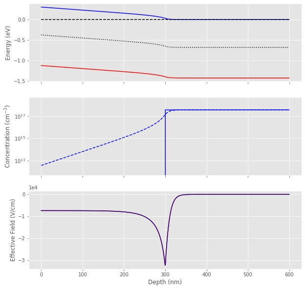

# NE 205: Semiconductor Devices and IC Technology

## Extension of Mid-Term Problem 3


```python
from obpds import *

chi=GaAs.electron_affinity()
```

## Solution using OBPDS for different thickness of i-GaAs

### t = 0.03 $\mu m$


```python
t=0.03
phi_b=0.3
phi_m=chi+phi_b

# Layers
i = Layer(t*um, GaAs)
n = Layer(t*um, GaAs, -3.6e17/cm3)

# Device
d = TwoTerminalDevice(layers=[i, n],
                      contacts=[SchottkyContact(phi_m), OhmicContact()],
                      Fn=['right','right'])

# Simulate and show the equilibrium band profile using the default method.
d.show_equilibrium()
```


    <Figure size 1000x1000 with 3 Axes>


### t = 0.1 $\mu m$


```python
phi_m=4.07
t=0.1
phi_b=0.3

# Layers
i = Layer(t*um, GaAs)
n = Layer(t*um, GaAs, -3.6e17/cm3)

# Device
d = TwoTerminalDevice(layers=[i, n],
                      contacts=[SchottkyContact(phi_m+phi_b), OhmicContact()],
                      Fn=['right','right'])

# Simulate and show the equilibrium band profile using the default method.
d.show_equilibrium()
```


### t = 0.3 $\mu m$


```python
t=0.3
phi_b=0.3
phi_m=chi+phi_b

# Layers
i = Layer(t*um, GaAs)
n = Layer(t*um, GaAs, -3.6e17/cm3)

# Device
d = TwoTerminalDevice(layers=[i, n],
                      contacts=[SchottkyContact(phi_m), OhmicContact()],
                      Fn=['right','right'])

# Simulate and show the equilibrium band profile using the default method.
d.show_equilibrium()
```





### t = 1.0 $\mu m$


```python
t=1.0
phi_b=0.3
phi_m=chi+phi_b

# Layers
i = Layer(t*um, GaAs)
n = Layer(t*um, GaAs, -3.6e17/cm3)

# Device
d = TwoTerminalDevice(layers=[i, n],
                      contacts=[SchottkyContact(phi_m), OhmicContact()],
                      Fn=['right','right'])

# Simulate and show the equilibrium band profile using the default method.
d.show_equilibrium()
```


### t = 3.0 $\mu m$


```python
t=3.0
phi_b=0.3
phi_m=chi+phi_b

# Layers
i = Layer(t*um, GaAs)
n = Layer(t*um, GaAs, -3.6e17/cm3)

# Device
d = TwoTerminalDevice(layers=[i, n],
                      contacts=[SchottkyContact(phi_m), OhmicContact()],
                      Fn=['right','right'])

# Simulate and show the equilibrium band profile using the default method.
d.show_equilibrium()
```


### t = 10.0 $\mu m$


```python
t=10.0
phi_b=0.3
phi_m=chi+phi_b

# Layers
i = Layer(t*um, GaAs)
n = Layer(t*um, GaAs, -3.6e17/cm3)

# Device
d = TwoTerminalDevice(layers=[i, n],
                      contacts=[SchottkyContact(phi_m), OhmicContact()],
                      Fn=['right','right'])

# Simulate and show the equilibrium band profile using the default method.
d.show_equilibrium()
```


### t = 30.0 $\mu m$


```python
t=30.0
phi_b=0.3
phi_m=chi+phi_b

# Layers
i = Layer(t*um, GaAs)
n = Layer(t*um, GaAs, -3.6e17/cm3)

# Device
d = TwoTerminalDevice(layers=[i, n],
                      contacts=[SchottkyContact(phi_m), OhmicContact()],
                      Fn=['right','right'])

# Simulate and show the equilibrium band profile using the default method.
d.show_equilibrium()
```


### t = 100.0 $\mu m$


```python
t=100.0
phi_b=0.3
phi_m=chi+phi_b

# Layers
i = Layer(t*um, GaAs)
n = Layer(t*um, GaAs, -3.6e17/cm3)

# Device
d = TwoTerminalDevice(layers=[i, n],
                      contacts=[SchottkyContact(phi_m), OhmicContact()],
                      Fn=['right','right'])

# Simulate and show the equilibrium band profile using the default method.
d.show_equilibrium()
```


### t = 300.0 $\mu m$


```python
t=300.0
phi_b=0.3
phi_m=chi+phi_b

# Layers
i = Layer(t*um, GaAs)
n = Layer(t*um, GaAs, -3.6e17/cm3)

# Device
d = TwoTerminalDevice(layers=[i, n],
                      contacts=[SchottkyContact(phi_m), OhmicContact()],
                      Fn=['right','right'])

# Simulate and show the equilibrium band profile using the default method.
d.show_equilibrium()
```


## Solution using OBPDS for different values of schottky barrier

### $\phi_B$ = 0 V


```python
t=0.3
phi_b=0
phi_m=chi+phi_b

# Layers
i = Layer(t*um, GaAs)
n = Layer(t*um, GaAs, -3.6e17/cm3)

# Device
d = TwoTerminalDevice(layers=[i, n],
                      contacts=[SchottkyContact(phi_m), OhmicContact()],
                      Fn=['right','right'])

# Simulate and show the equilibrium band profile using the default method.
d.show_equilibrium()
```


### $\phi_B$ = 0.1 V


```python
t=0.3
phi_b=0.1
phi_m=chi+phi_b

# Layers
i = Layer(t*um, GaAs)
n = Layer(t*um, GaAs, -3.6e17/cm3)

# Device
d = TwoTerminalDevice(layers=[i, n],
                      contacts=[SchottkyContact(phi_m), OhmicContact()],
                      Fn=['right','right'])

# Simulate and show the equilibrium band profile using the default method.
d.show_equilibrium()
```


### $\phi_B$ = 0.2 V


```python
t=0.3
phi_b=0.2
phi_m=chi+phi_b

# Layers
i = Layer(t*um, GaAs)
n = Layer(t*um, GaAs, -3.6e17/cm3)

# Device
d = TwoTerminalDevice(layers=[i, n],
                      contacts=[SchottkyContact(phi_m), OhmicContact()],
                      Fn=['right','right'])

# Simulate and show the equilibrium band profile using the default method.
d.show_equilibrium()
```


### $\phi_B$ = 0.3 V


```python
t=0.3
phi_b=0.3
phi_m=chi+phi_b

# Layers
i = Layer(t*um, GaAs)
n = Layer(t*um, GaAs, -3.6e17/cm3)

# Device
d = TwoTerminalDevice(layers=[i, n],
                      contacts=[SchottkyContact(phi_m), OhmicContact()],
                      Fn=['right','right'])

# Simulate and show the equilibrium band profile using the default method.
d.show_equilibrium()
```


### $\phi_B$ = 0.4 V


```python
t=0.3
phi_b=0.4
phi_m=chi+phi_b

# Layers
i = Layer(t*um, GaAs)
n = Layer(t*um, GaAs, -3.6e17/cm3)

# Device
d = TwoTerminalDevice(layers=[i, n],
                      contacts=[SchottkyContact(phi_m), OhmicContact()],
                      Fn=['right','right'])

# Simulate and show the equilibrium band profile using the default method.
d.show_equilibrium()
```


### $\phi_B$ = 0.5 V


```python
t=0.3
phi_b=0.5
phi_m=chi+phi_b

# Layers
i = Layer(t*um, GaAs)
n = Layer(t*um, GaAs, -3.6e17/cm3)

# Device
d = TwoTerminalDevice(layers=[i, n],
                      contacts=[SchottkyContact(phi_m), OhmicContact()],
                      Fn=['right','right'])

# Simulate and show the equilibrium band profile using the default method.
d.show_equilibrium()
```


### $\phi_B$ = 0.6 V


```python
t=0.3
phi_b=0.6
phi_m=chi+phi_b

# Layers
i = Layer(t*um, GaAs)
n = Layer(t*um, GaAs, -3.6e17/cm3)

# Device
d = TwoTerminalDevice(layers=[i, n],
                      contacts=[SchottkyContact(phi_m), OhmicContact()],
                      Fn=['right','right'])

# Simulate and show the equilibrium band profile using the default method.
d.show_equilibrium()
```


### $\phi_B$ = 0.7 V


```python
t=0.3
phi_b=0.7
phi_m=chi+phi_b

# Layers
i = Layer(t*um, GaAs)
n = Layer(t*um, GaAs, -3.6e17/cm3)

# Device
d = TwoTerminalDevice(layers=[i, n],
                      contacts=[SchottkyContact(phi_m), OhmicContact()],
                      Fn=['right','right'])

# Simulate and show the equilibrium band profile using the default method.
d.show_equilibrium()
```


